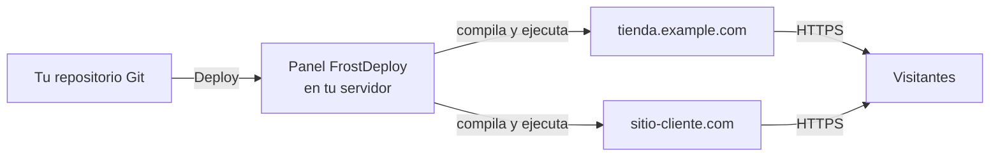
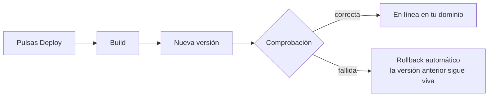

<div align="center">


<p>
  <a href="README.md"></a>
  <a href="README.ru.md"></a>
  <a href="README.zh-CN.md"></a>
  <a href="README.es.md"></a>
</p>

<h3>Tu propio Vercel, en tu propio servidor.</h3>

<p><b>FrostDeploy es una plataforma de despliegue autoalojada para tu VPS/VDS:<br>
una alternativa a Vercel, Netlify y Render que te pertenece por completo.</b><br>
Conecta un repositorio Git y pulsa Deploy: build, HTTPS, dominios y rollback ya están resueltos.</p>

<p>
  <a href="https://github.com/ARTFROST1/FrostDeploy/releases/latest"></a>
  <a href="https://github.com/ARTFROST1/FrostDeploy/releases"></a>
  
  <a href="LICENSE"></a>
</p>

<p>
  
  
  
  
  
</p>

</div>

---

## ⚡ Instalación

Un solo comando en un servidor limpio con Debian 12+ / Ubuntu 22.04+, como `root`:

```bash
curl -fsSL https://raw.githubusercontent.com/ARTFROST1/FrostDeploy/main/install.sh | sudo bash
```

Después sigue la **[Guía rápida](#-guía-rápida)**: cinco pasos, unos diez minutos, desde un servidor
vacío hasta tu primer sitio en línea con HTTPS.

---

## 🤖 O deja que lo haga tu agente de IA

¿Nunca has tocado un servidor? Delega todo el proceso en Claude Code, Cursor, Codex o cualquier
agente de programación: este repositorio está escrito para que ellos lo entiendan.

**Envíale este enlace a tu agente:**

```
https://github.com/ARTFROST1/FrostDeploy
```

**…o pega este prompt:**

```text
Instala FrostDeploy en mi servidor y configúralo de principio a fin.

Las instrucciones están aquí: https://github.com/ARTFROST1/FrostDeploy
(el README y AGENTS.md). Síguelas paso a paso.

Mi servidor:  root@<IP-DEL-SERVIDOR>
Mi dominio:   <example.com>

Pídeme todo lo que necesites (acceso al DNS, token de GitHub, contraseñas),
dime exactamente qué tengo que pulsar y termina cuando el panel esté abierto
en mi navegador con mi propio dominio.
```

El agente comprobará tu DNS, ejecutará el instalador, abrirá el túnel SSH, te guiará por el
asistente de configuración y te entregará un panel funcionando. Las instrucciones legibles por
máquina están en **[AGENTS.md](AGENTS.md)**.

---

## 🧊 Qué obtienes

Una plataforma de despliegue que se comporta como Vercel o Netlify, pero donde el servidor, los
dominios, los datos y la factura son tuyos.

- **Proyectos y sitios ilimitados** en una sola máquina: sin precio por usuario, sin límite de
  minutos de build.
- **Tus propios dominios**, con certificados HTTPS emitidos y renovados automáticamente.
- **Despliegue con un clic** desde tus repositorios de GitHub, incluidos los privados.
- **Rollback instantáneo** a cualquier versión anterior, aproximadamente un segundo.
- **Funciona en cualquier sitio**: cualquier VPS, VDS, servidor dedicado o máquina en casa con
  Debian o Ubuntu. 1 GB de RAM basta para empezar.
- **Sin Docker, sin Kubernetes, sin cuenta de terceros.** Nada llama a casa.

Encaja bien para freelancers y estudios que alojan sitios de clientes, para proyectos personales que
se quedaron sin plan gratuito y para cualquiera que prefiera un PaaS autoalojado antes que una
factura mensual de SaaS.

---

## 🚀 Guía rápida

### Paso 1 — Consigue un servidor

Cualquier VPS o VDS con **Debian 12+ o Ubuntu 22.04+** (`x86_64`), desde 1 vCPU / 1 GB RAM / 10 GB de
disco. Al contratarlo, rellena **ambos** campos:

- **Clave SSH**: pega el contenido de tu `~/.ssh/id_ed25519.pub`. Es tu acceso del día a día.
- **Contraseña de root**: guárdala en tu gestor de contraseñas. Es la entrada de emergencia a través
  de la consola VNC del proveedor.

### Paso 2 — Apunta un dominio hacia él

Necesitas un dominio para todo el sistema. En tu proveedor de DNS crea **dos registros A** que
apunten a la IP del servidor:

```dns
A   @   →   <IP del servidor>      ; el dominio en sí
A   *   →   <IP del servidor>      ; comodín — obligatorio
```

El comodín es lo que hace que cada proyecto futuro reciba una dirección como
`mitienda.example.com` sin volver a tocar el DNS. Compruébalo antes de instalar: cualquier nombre
inventado debe resolver:

```bash
dig +short A cualquiercosa.example.com @1.1.1.1   # debe devolver la IP de tu servidor
```

### Paso 3 — Ejecuta el instalador

```bash
ssh root@<IP del servidor>
curl -fsSL https://raw.githubusercontent.com/ARTFROST1/FrostDeploy/main/install.sh | sudo bash
```

Entre dos y cinco minutos. Instala todo lo necesario y arranca el panel.

### Paso 4 — Abre el panel por un túnel SSH

Hasta que el panel tiene tu dominio y su certificado no se expone a internet, así que el primer
acceso se hace por un túnel SSH.

> [!IMPORTANT]
> Ejecuta esto **en tu propio ordenador**, no en el servidor. Si tu prompt dice `root@server:~#`,
> abre primero una ventana nueva de terminal.

```bash
ssh -L 9000:127.0.0.1:9000 root@<IP del servidor>
```

Deja esa ventana abierta y entra en **http://127.0.0.1:9000** desde tu navegador.

### Paso 5 — Completa el asistente

| Campo | Qué poner |
| --- | --- |
| Contraseña de administrador | Mínimo 14 caracteres. Guárdala en tu gestor de contraseñas |
| Token de GitHub | Un fine-grained personal access token con `Contents: Read` sobre los repositorios que quieras desplegar — [créalo aquí](https://github.com/settings/personal-access-tokens) |
| Tu dominio | Solo el dominio, por ejemplo `example.com` — sin `https://` y sin subdominio |

Listo. El panel pasa a **`https://frostdeploy.example.com`** con su propio certificado y ya puedes
cerrar el túnel. A partir de aquí todo ocurre en la interfaz: añadir un proyecto, elegir el
repositorio y pulsar Deploy.

> [!WARNING]
> Guarda dos cosas en tu gestor de contraseñas: la contraseña de administrador y la línea
> `ENCRYPTION_KEY` de `/opt/frostdeploy/.env`. Esa clave protege todo lo que el panel almacena: si
> pierdes el servidor junto con la clave, una copia de seguridad no te servirá de nada.

---

## ✨ Funciones

|  | Función | Qué significa para ti |
| :-: | --- | --- |
| 🔍 | **Detección automática del framework** | Next.js, Astro, Nuxt, SvelteKit, Remix, Python o HTML estático: se reconocen solos, sin configuración |
| 🚀 | **Despliegue con un clic** | Eliges repositorio y rama y pulsas Deploy. Las builds se cachean, así que repetir es rápido |
| 📡 | **Logs de build en vivo** | Ves cada paso en el panel y puedes cancelar una build a mitad |
| 🔄 | **Rollback instantáneo** | Un clic para volver a cualquier versión anterior |
| 🌐 | **Dominios y HTTPS gratis** | Dominios propios y subdominios automáticos, con certificados emitidos y renovados por ti |
| 🔐 | **Secretos cifrados** | Variables de entorno y tokens guardados cifrados; al cambiarlos se relanza la build |
| 👥 | **Sitios aislados** | Cada sitio corre con su propio usuario del sistema: un proyecto no puede leer a otro |
| 🖥 | **Varios servidores** | Un panel, muchos servidores: cada cliente en su máquina si hace falta |
| 📊 | **Monitorización** | CPU, RAM y disco en tiempo real, además del estado de cada sitio |
| 🔒 | **Control de acceso serio** | Autenticación en dos pasos, certificados de cliente opcionales, actualizaciones firmadas y verificadas |
| 💾 | **Copias de seguridad** | Programadas, en local o en cualquier almacenamiento compatible con S3 |
| 📝 | **Portal CMS para clientes** | Aplicación opcional donde tus clientes editan el contenido de su sitio sin tocar código |

**Próximamente:** despliegue automático en cada push (webhooks de Git), para que un `git push` publique el sitio.

---

## 🛠 Cómo funciona



Cada despliegue sigue el mismo camino seguro, y si la versión nueva no arranca, la anterior sigue
atendiendo a los visitantes:



---

## ⌨️ Línea de comandos

Todo se hace desde el panel. Estos comandos existen para el momento puntual en el que necesitas el
servidor:

| Comando | Qué hace |
| --- | --- |
| `frostdeploy status` | ¿Está funcionando el panel? |
| `frostdeploy logs` | Logs del panel en vivo |
| `frostdeploy restart` | Reinicia el panel |
| `frostdeploy update` | Actualiza a la última versión — vuelve atrás solo si algo falla |
| `frostdeploy rollback` | Vuelve a la versión anterior |
| `frostdeploy reset-password` | Nueva contraseña de administrador si te quedas fuera |
| `frostdeploy uninstall` | Desinstala FrostDeploy (con `--purge` borra también datos y sitios) |

---

## 🧯 Solución de problemas

<details>
<summary><b>El navegador no abre <code>http://127.0.0.1:9000</code></b></summary>

Casi siempre es porque el comando `ssh -L …` se ejecutó en el servidor y no en tu propio ordenador.
Mira el prompt: `tu@tu-portatil ~ %` eres tú, `root@server:~#` es el servidor. Después, en el
servidor, ejecuta `frostdeploy status` para confirmar que el panel está corriendo.

</details>

<details>
<summary><b>El instalador dice <code>Unsupported OS</code></b></summary>

FrostDeploy necesita Debian 12+ o Ubuntu 22.04+ sobre `x86_64`. AlmaLinux, CentOS, Rocky, Fedora,
Arch y arm64 no están soportados. Reinstala el servidor con una imagen compatible.

</details>

<details>
<summary><b>El dominio no abre o no tiene certificado</b></summary>

Revisa los dos registros DNS, comodín incluido: `dig +short A cualquiercosa.example.com @1.1.1.1`
debe devolver la IP de tu servidor. Los certificados solo se emiten cuando el dominio ya apunta al
servidor y los puertos 80 y 443 son accesibles. La propagación DNS puede tardar horas.

</details>

<details>
<summary><b>Un despliegue falla</b></summary>

Abre el log de build en el panel: indica el paso exacto que falla. Las causas habituales son una
variable de entorno que falta, una build que necesita más memoria, o un repositorio privado que el
token de GitHub no puede leer. Mientras tanto, la versión desplegada anteriormente sigue en línea.

</details>

<details>
<summary><b>Algo se rompió tras una actualización</b></summary>

`frostdeploy rollback` te devuelve a la versión anterior.

</details>

---

## ❓ Preguntas frecuentes

<details>
<summary><b>¿En qué se diferencia de Vercel, Netlify o Render?</b></summary>

El flujo de trabajo es el mismo; cambian la economía y el control. Tus sitios corren en hardware que
alquilas o posees: sin límites de minutos de build, sin sorpresas de ancho de banda, sin precio por
usuario y sin un tercero al mando de tu producción. Pagas el servidor y nada más.

</details>

<details>
<summary><b>¿Hace falta saber Linux?</b></summary>

Para instalar hay que copiar y pegar dos comandos. Todo lo demás ocurre en el panel web. Y si
incluso eso te sobra, pásale el [prompt para el agente](#-o-deja-que-lo-haga-tu-agente-de-ia) a
cualquier asistente de IA y hará la configuración contigo.

</details>

<details>
<summary><b>¿Cuántos sitios caben en un servidor?</b></summary>

Los sitios estáticos apenas cuestan nada: caben decenas sin problema. Las aplicaciones renderizadas
en servidor (Next.js, Nuxt) sí consumen memoria real: calcula entre 150 y 300 MB cada una, así que
una máquina de 2 GB aguanta varias más el propio panel.

</details>

<details>
<summary><b>¿Funciona con repositorios privados?</b></summary>

Sí. Para eso está el token de GitHub del asistente de configuración, que se guarda cifrado.

</details>

<details>
<summary><b>¿Necesito Docker?</b></summary>

No. No hay imágenes que construir, subir ni descargar: los sitios corren directamente en el
servidor, que es justo por lo que 1 GB de RAM basta para empezar.

</details>

<details>
<summary><b>¿Puedo mudarme a otro servidor más adelante?</b></summary>

Sí: instala FrostDeploy en el servidor nuevo y restaura una copia de seguridad.

</details>

<details>
<summary><b>¿El código fuente es abierto?</b></summary>

No. Este repositorio distribuye el instalador y las builds listas para ejecutar; el código de la
aplicación es privado. Las actualizaciones van firmadas y se verifican automáticamente antes de
instalarse.

</details>

---

## 🧱 Por dentro

Para los curiosos: Node.js 22, SQLite, [Caddy](https://caddyserver.com) para el HTTPS automático y
systemd para los procesos. Sin contenedores, sin orquestador y sin demonios en segundo plano
reportando a nadie, que es exactamente por lo que funciona bien en el VPS más barato que encuentres.

---

## 📄 Licencia

Propietaria — ver [LICENSE](LICENSE). El instalador es público para que pueda leerse antes de
ejecutarlo; el código fuente de la aplicación no se distribuye.

<div align="center">
<br>

**[⚡ Instalar ahora](#-instalación)** · [Releases](https://github.com/ARTFROST1/FrostDeploy/releases) · [Instrucciones para agentes](AGENTS.md) · [Hacer una pregunta](https://github.com/ARTFROST1/FrostDeploy/issues/new/choose)

[English](README.md) · [Русский](README.ru.md) · [简体中文](README.zh-CN.md) · [Español](README.es.md)

<sub><b>FrostDeploy</b> — plataforma de despliegue autoalojada y alternativa a Vercel, Netlify, Render
y Heroku para tu propio VPS. Despliega Next.js, Astro, Nuxt, SvelteKit, Remix y sitios estáticos en
tu servidor con HTTPS automático, dominios propios y rollback en un clic. Un PaaS autoalojado en la
línea de Coolify, Dokku y CapRover, pero sin Docker.</sub>

<sub>© 2026 ARTFROST1</sub>

</div>
