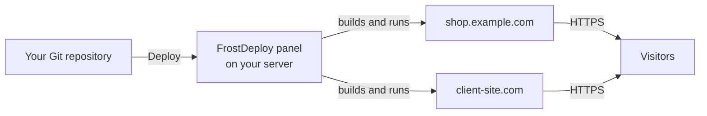
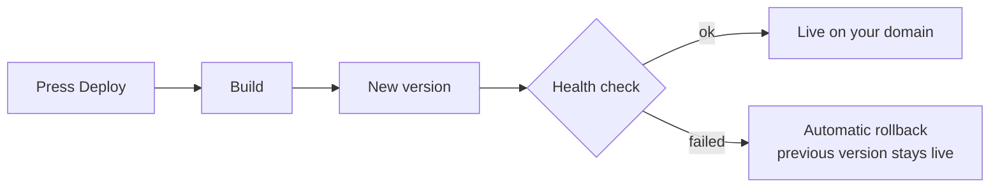

<div align="center">


<p>
  <a href="README.md"></a>
  <a href="README.ru.md"></a>
  <a href="README.zh-CN.md"></a>
  <a href="README.es.md"></a>
</p>

<h3>Your own Vercel, on your own server.</h3>

<p><b>FrostDeploy is a self-hosted deploy platform for your VPS/VDS —<br>
a Vercel, Netlify and Render alternative you fully own.</b><br>
Connect a Git repo, press Deploy: build, HTTPS, domain and rollback are handled for you.</p>

<p>
  <a href="https://github.com/ARTFROST1/FrostDeploy/releases/latest"></a>
  <a href="https://github.com/ARTFROST1/FrostDeploy/releases"></a>
  
  <a href="LICENSE"></a>
</p>

<p>
  
  
  
  
  
</p>

</div>

---

## ⚡ Install

One command on a fresh Debian 12+ / Ubuntu 22.04+ server, as `root`:

```bash
curl -fsSL https://raw.githubusercontent.com/ARTFROST1/FrostDeploy/main/install.sh | sudo bash
```

Then follow **[Quick start](#-quick-start)** — five steps, about ten minutes, from an empty server
to your first site live on HTTPS.

---

## 🤖 Or let your AI agent do it

Never touched a server? Hand the whole thing to Claude Code, Cursor, Codex or any coding agent —
this repository is written to be read by them.

**Send your agent this link:**

```
https://github.com/ARTFROST1/FrostDeploy
```

**…or paste this prompt:**

```text
Install FrostDeploy on my server and set it up end to end.

Read https://github.com/ARTFROST1/FrostDeploy — the README and AGENTS.md there are
the instructions. Follow them step by step.

My server:  root@<SERVER-IP>
My domain:  <example.com>

Ask me for anything you need (DNS access, GitHub token, passwords), tell me exactly
what to click, and stop when the panel is open in my browser on my own domain.
```

The agent will check your DNS, run the installer, open the SSH tunnel, walk you through the setup
wizard and hand you a working panel. Machine-readable instructions live in
**[AGENTS.md](AGENTS.md)**.

---

## 🧊 What you get

A deploy platform that behaves like Vercel or Netlify — but the server, the domains, the data and
the bill are yours.

- **Unlimited projects and sites** on one box — no per-seat pricing, no build-minute limits.
- **Your own domains**, HTTPS certificates issued and renewed automatically.
- **Push-button deploys** from your GitHub repositories, private ones included.
- **Instant rollback** to any previous version, roughly a second.
- **Runs anywhere** — any VPS, VDS, dedicated box or home server with Debian or Ubuntu. 1 GB RAM
  is enough to start.
- **No Docker, no Kubernetes, no vendor account.** Nothing calls home.

Good fit for freelancers and studios hosting client sites, for side projects that outgrew a free
tier, and for anyone who wants a self-hosted PaaS instead of a monthly SaaS invoice.

---

## 🚀 Quick start

### Step 1 — Get a server

Any VPS or VDS with **Debian 12+ or Ubuntu 22.04+** (`x86_64`), from 1 vCPU / 1 GB RAM / 10 GB
disk. When ordering, fill in **both**:

- **SSH key** — paste your `~/.ssh/id_ed25519.pub`. This is your everyday login.
- **root password** — save it in a password manager. It is the emergency way in through the
  hosting provider's VNC console.

### Step 2 — Point a domain at it

You need one domain for everything. In your DNS provider, create **two A records** pointing at the
server IP:

```dns
A   @   →   <server IP>      ; the domain itself
A   *   →   <server IP>      ; wildcard — required
```

The wildcard is what gives every future project an address like `myshop.example.com` without you
touching DNS again. Check it before installing — any made-up name must resolve:

```bash
dig +short A anything.example.com @1.1.1.1   # must return your server IP
```

### Step 3 — Run the installer

```bash
ssh root@<server IP>
curl -fsSL https://raw.githubusercontent.com/ARTFROST1/FrostDeploy/main/install.sh | sudo bash
```

Two to five minutes. It installs everything needed and starts the panel.

### Step 4 — Open the panel through an SSH tunnel

The panel is not exposed to the internet until it has your domain and a certificate, so the first
login goes through an SSH tunnel.

> [!IMPORTANT]
> Run this **on your own computer**, not on the server. If your prompt says `root@server:~#`,
> open a new terminal window first.

```bash
ssh -L 9000:127.0.0.1:9000 root@<server IP>
```

Leave that window open and go to **http://127.0.0.1:9000** in your browser.

### Step 5 — Finish the setup wizard

| Field | What to enter |
| --- | --- |
| Admin password | At least 14 characters. Save it in your password manager |
| GitHub token | A fine-grained personal access token with `Contents: Read` for the repositories you want to deploy — [create one here](https://github.com/settings/personal-access-tokens) |
| Your domain | Just the domain, e.g. `example.com` — no `https://`, no subdomain |

Done. The panel moves to **`https://frostdeploy.example.com`** with a certificate of its own, and
you can close the tunnel. From here everything happens in the UI: add a project, pick a repository,
press Deploy.

> [!WARNING]
> Save two things in your password manager: the admin password and the `ENCRYPTION_KEY` line from
> `/opt/frostdeploy/.env`. That key protects everything stored in the panel — lose the server
> together with the key and a backup will not help you.

---

## ✨ Features

|  | Feature | What it means for you |
| :-: | --- | --- |
| 🔍 | **Framework autodetection** | Next.js, Astro, Nuxt, SvelteKit, Remix, Python, plain static — recognized automatically, no config to write |
| 🚀 | **One-click deploy** | Pick a repo and a branch, press Deploy. Builds are cached, so repeat deploys are fast |
| 📡 | **Live build logs** | Watch every step in the dashboard, cancel a build mid-run |
| 🔄 | **Instant rollback** | One click back to any previous version |
| 🌐 | **Domains & free HTTPS** | Custom domains and automatic subdomains, certificates issued and renewed for you |
| 🔐 | **Encrypted secrets** | Environment variables and tokens stored encrypted, changes trigger a rebuild |
| 👥 | **Isolated sites** | Every site runs under its own system user — one project cannot read another |
| 🖥 | **Multiple servers** | One panel, many servers: keep clients on separate machines |
| 📊 | **Monitoring** | CPU, RAM and disk in real time, plus per-site status |
| 🔒 | **Serious access control** | Two-factor authentication, optional client certificates, signed and verified updates |
| 💾 | **Backups** | Scheduled backups, locally or to any S3-compatible storage |
| 📝 | **Client CMS portal** | Optional companion app where your clients edit their own site content without touching code |

**Coming next:** automatic deploys on every push (Git webhooks), so a `git push` ships the site.

---

## 🛠 How it works



Every deploy follows the same safe path — and if the new version does not come up, the old one
keeps serving traffic:



---

## ⌨️ Command line

Everything is done from the panel UI. These commands exist for the rare moment you need the server
itself:

| Command | What it does |
| --- | --- |
| `frostdeploy status` | Is the panel running? |
| `frostdeploy logs` | Live panel logs |
| `frostdeploy restart` | Restart the panel |
| `frostdeploy update` | Update to the latest version — rolls back by itself if anything is wrong |
| `frostdeploy rollback` | Go back to the previous version |
| `frostdeploy reset-password` | Set a new admin password if you are locked out |
| `frostdeploy uninstall` | Remove FrostDeploy (add `--purge` to delete data and sites too) |

---

## 🧯 Troubleshooting

<details>
<summary><b>The browser will not open <code>http://127.0.0.1:9000</code></b></summary>

Almost always the `ssh -L …` command was run on the server instead of your own computer. Check the
prompt: `you@your-laptop ~ %` is yours, `root@server:~#` is the server. Then, on the server, run
`frostdeploy status` to confirm the panel is running.

</details>

<details>
<summary><b>The installer says <code>Unsupported OS</code></b></summary>

FrostDeploy needs Debian 12+ or Ubuntu 22.04+ on `x86_64`. AlmaLinux, CentOS, Rocky, Fedora, Arch
and arm64 are not supported. Reinstall the server with a supported image.

</details>

<details>
<summary><b>The domain does not open, or has no certificate</b></summary>

Check both DNS records, wildcard included: `dig +short A anything.example.com @1.1.1.1` must return
your server IP. Certificates are only issued once the domain points at the server and ports 80 and
443 are reachable. DNS changes can take up to a few hours to propagate.

</details>

<details>
<summary><b>A deploy fails</b></summary>

Open the build log in the dashboard — it shows the exact failing step. The usual causes are a
missing environment variable, a build command that needs more memory, or a private repository the
GitHub token cannot read. The previously deployed version keeps running the whole time.

</details>

<details>
<summary><b>Something broke after an update</b></summary>

`frostdeploy rollback` returns you to the previous version.

</details>

---

## ❓ FAQ

<details>
<summary><b>How is this different from Vercel, Netlify or Render?</b></summary>

Same workflow, different economics and control. Your sites run on hardware you rent or own, so
there are no build-minute limits, no bandwidth surprises, no per-seat pricing, and no third party
holding your production. You pay for the server and nothing else.

</details>

<details>
<summary><b>Do I need to know Linux?</b></summary>

For the install, you need to copy and paste two commands. Everything after that happens in the web
panel. If even that feels like a lot, hand the [agent prompt](#-or-let-your-ai-agent-do-it) to an
AI assistant and it will do the setup with you.

</details>

<details>
<summary><b>How many sites fit on one server?</b></summary>

Static sites cost almost nothing — dozens fit comfortably. Server-rendered apps (Next.js, Nuxt) use
real memory: budget roughly 150–300 MB each, so a 2 GB box handles several of them plus the panel.

</details>

<details>
<summary><b>Does it work with private repositories?</b></summary>

Yes. That is what the GitHub token in the setup wizard is for; it is stored encrypted.

</details>

<details>
<summary><b>Do I need Docker?</b></summary>

No. Nothing to build, push or pull — sites run directly on the server, which is why 1 GB of RAM is
enough to start.

</details>

<details>
<summary><b>Can I move to another server later?</b></summary>

Yes — install FrostDeploy on the new server and restore a backup.

</details>

<details>
<summary><b>Is the source code open?</b></summary>

No. This repository distributes the installer and the ready-to-run builds; the application source
is private. Updates are signed and verified automatically before they are installed.

</details>

---

## 📚 Documentation

Everything needed to run FrostDeploy without access to its source code lives in
**[docs/](docs/)**:

| Document | What is in it |
| --- | --- |
| [First site](docs/first-deploy.md) | From a fresh install to your first site live on HTTPS |
| [**frostdeploy.json**](docs/frostdeploy-json.md) | The configuration reference: build, start command, static output, monorepos, python workers, several services in one repository |
| [Environment variables](docs/environment-variables.md) | Build time versus runtime, and why secrets never reach the build |
| [Domains and HTTPS](docs/domains.md) | Platform addresses, custom domains, certificates, `www`, redirects |
| [Adding servers](docs/servers.md) | One panel, many servers, and what the bootstrap does |
| [Operating your install](docs/operations.md) | Updates, rollbacks, a site that is down, backups, secrets |
| [Client CMS portal](docs/cms-portal.md) | The optional portal where clients edit their own content |

---

## 🧱 Under the hood

For the curious: Node.js 22, SQLite, [Caddy](https://caddyserver.com) for automatic HTTPS, and
systemd for processes. No containers, no orchestrator, no background daemons phoning home — which
is exactly why it runs happily on the cheapest VPS you can rent.

---

## 📄 License

Proprietary — see [LICENSE](LICENSE). The installer is public so it can be read before it runs; the
application source code is not distributed.

<div align="center">
<br>

**[⚡ Install now](#-install)** · [Releases](https://github.com/ARTFROST1/FrostDeploy/releases) · [Agent instructions](AGENTS.md) · [Ask a question](https://github.com/ARTFROST1/FrostDeploy/issues/new/choose)

[English](README.md) · [Русский](README.ru.md) · [简体中文](README.zh-CN.md) · [Español](README.es.md)

<sub><b>FrostDeploy</b> — self-hosted deploy platform and a Vercel, Netlify, Render and Heroku
alternative for your own VPS. Deploy Next.js, Astro, Nuxt, SvelteKit, Remix and static sites to your
own server with automatic HTTPS, custom domains and one-click rollback. A self-hosted PaaS in the
spirit of Coolify, Dokku and CapRover — without Docker.</sub>

<sub>© 2026 ARTFROST1</sub>

</div>
