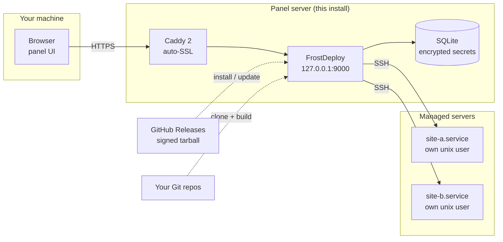
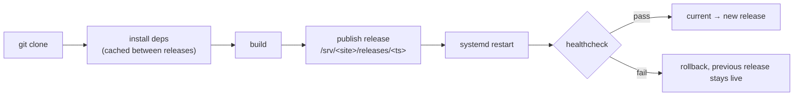

<div align="center">


<h3>Ship sites to your own server the way you ship them to Vercel — from your own panel, on your own VDS.</h3>

<p>
  <a href="https://github.com/ARTFROST1/FrostDeploy/releases/latest"></a>
  <a href="https://github.com/ARTFROST1/FrostDeploy/releases"></a>
  <a href="https://github.com/ARTFROST1/FrostDeploy/releases"></a>
  <a href="LICENSE"></a>
</p>

<p>
  
  
  
  
  
  
  
</p>

<p>
  <a href="#-quick-start"><b>Quick start</b></a> ·
  <a href="#-how-it-works"><b>How it works</b></a> ·
  <a href="#-features"><b>Features</b></a> ·
  <a href="#-cli">CLI</a> ·
  <a href="#-release-integrity">Release integrity</a> ·
  <a href="#-troubleshooting">Troubleshooting</a> ·
  <a href="#-faq">FAQ</a> ·
  <a href="README.ru.md">🇷🇺 Русский</a>
</p>

</div>

---

## 🧊 What is this

**FrostDeploy** is a self-hosted deploy platform — a small Vercel that lives on a VDS you own.
You connect a Git repository, press *Deploy*, and the platform clones it, installs
dependencies, builds, publishes an atomic release, writes a systemd unit, routes a domain
through Caddy and issues the TLS certificate. Rollback is one click and one symlink.

No Docker, no Kubernetes, no control plane in someone else's cloud: **Node.js 22 + SQLite +
Caddy + systemd** on a plain Debian or Ubuntu box.

> [!NOTE]
> **This repository is the distribution channel, not the source.**
> It carries the installer (`install.sh`) and the signed release artifacts under
> [Releases](https://github.com/ARTFROST1/FrostDeploy/releases). The application source code
> is private — servers always run a built, signed tarball, never a `git clone` of the engine.

| In this repo | What it is |
| --- | --- |
| [`install.sh`](install.sh) | The installer. Synced automatically from the source repo on every release |
| [Releases](https://github.com/ARTFROST1/FrostDeploy/releases) | `frostdeploy-<version>-linux-x64.tar.gz` + `.sig` (ed25519) + `.sha256` |
| [`CHANGELOG.md`](CHANGELOG.md) | Release history and versioning scheme |
| — | No application source code. By design |

---

## 🚀 Quick start

### 1. Prerequisites

| Requirement | Details |
| --- | --- |
| **VDS** | 1 vCPU · 1 GB RAM · 10 GB disk (minimum for the panel plus a few small sites) |
| **OS** | **Debian 12+** or **Ubuntu 22.04+**, `x86_64`. The installer is `apt`-based — AlmaLinux, CentOS, Rocky, Fedora and Arch are not supported |
| **Access** | SSH as `root` |
| **Domain** | A domain you can edit DNS for |
| **GitHub PAT** | Fine-grained token with `Contents: Read` on the repos you want to deploy. **The setup wizard asks for it — it cannot be skipped** |

### 2. DNS: two A records

```dns
A   @   →   <server IP>      ; apex
A   *   →   <server IP>      ; wildcard — required
```

The wildcard is not optional: a project's address is `<project>.<your-domain>`, computed from
the project name rather than stored, so every new site would otherwise need a manual DNS record.
Verify before installing, using any made-up subdomain:

```bash
dig +short A anything.your-domain.com @1.1.1.1   # must return the server IP
```

### 3. Run the installer

```bash
ssh root@your-server
curl -fsSL https://raw.githubusercontent.com/ARTFROST1/FrostDeploy/main/install.sh | sudo bash
```

Two to five minutes. Look for this line in the output — the tarball is unpacked **as root**, so
an unverified archive must stop the install:

```
 ✅ подпись релиза проверена (ed25519)
```

<details>
<summary><b>Prefer to read before you pipe to a shell? (recommended)</b></summary>

```bash
curl -fsSL -o install.sh https://raw.githubusercontent.com/ARTFROST1/FrostDeploy/main/install.sh
less install.sh
sudo bash install.sh
```

The script is idempotent: re-running it upgrades to the latest release and preserves
`/opt/frostdeploy/.env` and your database.

</details>

### 4. First login — over an SSH tunnel

The panel binds **`127.0.0.1:9000` only** and is never exposed to the internet. Port 9000 is not
opened in the firewall, and it should never be: the panel holds root-equivalent access to every
server it manages, so its login form has no business being publicly reachable.

> [!IMPORTANT]
> Run the next command **on your own machine**, not on the server. If your prompt reads
> `root@server:~#` you are still on the server — open a new terminal window.

```bash
ssh -L 9000:127.0.0.1:9000 root@your-server
```

Leave it running and open **http://127.0.0.1:9000** in your browser. The setup wizard asks for:

| Field | Requirement |
| --- | --- |
| Admin password | 14 characters minimum |
| GitHub PAT | from step 1 |
| Platform domain | the apex, e.g. `example.com` — no `https://`, no subdomain |

After the wizard the panel is reachable over HTTPS at `frostdeploy.<your-domain>`, with Caddy
obtaining the certificate. The tunnel is no longer needed day to day — but keep the command
handy: it reaches the panel *around* Caddy, so it still works when HTTPS or client-certificate
checks are what broke.

> [!WARNING]
> Save the admin password **and** `ENCRYPTION_KEY` from `/opt/frostdeploy/.env` in your password
> manager. That key encrypts everything sensitive in the database — the GitHub token, server SSH
> keys, project environment variables. Lose the server together with the key and a database
> backup is worthless.

---

## 🛠 How it works



A deploy is a fixed pipeline, and every step is streamed to the dashboard live:



Releases are directories; `current` is a symlink. Switching versions — forward or back — is an
atomic symlink swap plus a service restart, which is why rollback takes about a second.

<details>
<summary><b>What the installer actually changes on the host</b></summary>

| Path / object | Purpose |
| --- | --- |
| `/opt/frostdeploy/releases/<version>` | Unpacked release; `current` symlinks to the active one |
| `/opt/frostdeploy/.env` | `ENCRYPTION_KEY`, `SESSION_SECRET`, config. Mode `600`, root-owned |
| `/var/lib/frostdeploy/` | SQLite database, backups, build scratch. Mode `750` |
| `/etc/systemd/system/frostdeploy.service` | The panel unit |
| `/usr/local/bin/frostdeploy` | Management CLI |
| system user `frostdeploy` | Service account, `nologin` shell |
| Node.js 22 (NodeSource), `jq`, Caddy 2 | Installed via `apt` if missing |
| ufw rule for port 9000 | **Removed** if a previous install left it open |

Deployed sites live under `/srv/`, each with its own unix user and its own `fd-*.service` unit.

</details>

---

## ✨ Features

|  | Feature | What it means |
| :-: | --- | --- |
| 🔍 | **Framework autodetection** | Next.js, Astro, Nuxt, SvelteKit, Remix, Python, static — detected from the repo, no config required |
| 🚀 | **One-click deploy** | `clone → install → build → release → restart → healthcheck`, with dependency caching between releases |
| 📡 | **Live logs** | Every pipeline step streamed to the dashboard over SSE, cancellable mid-build |
| 🔄 | **Instant rollback** | Atomic symlink swap back to any previous release |
| 🌐 | **Domains & auto-SSL** | Platform subdomains and custom domains, certificates via Caddy + Let's Encrypt, DNS/cert/HTTPS state checked from the UI |
| 🔐 | **Encrypted secrets** | AES-256-GCM for env vars, SSH keys and tokens; key rotation via `frostdeploy reencrypt` |
| 👥 | **Per-site isolation** | Every site gets its own unix user and systemd unit; the panel reaches privileged actions through a narrow sudoers allowlist |
| 🖥 | **Multi-server** | One panel manages several servers over SSH |
| 📊 | **Monitoring** | CPU, RAM, disk in real time |
| 🔒 | **2FA & mTLS** | TOTP for the admin account, optional client-certificate gate in front of the panel |
| 🧱 | **Host hardening** | `harden-host.sh` — ufw, fail2ban, sshd drop-in, unattended-upgrades, journald, permission audit, with `--dry-run` and a verification gate |
| 💾 | **Backups** | Scheduled database backups, local or S3-compatible |
| 📝 | **Client CMS portal** | Optional companion service where clients edit their own site content |

---

## ⌨️ CLI

The installer puts `frostdeploy` in `/usr/local/bin`. Run it on the panel server.

| Command | What it does |
| --- | --- |
| `frostdeploy status` | `systemctl status` for the panel |
| `frostdeploy logs` | Follow the panel journal (`journalctl -f`) |
| `frostdeploy restart` | Restart the panel (and the portal, if installed) |
| `frostdeploy update` | Download the latest signed release, switch, restart — **auto-rollback if the healthcheck fails** |
| `frostdeploy rollback` | Switch back to the previous release |
| `frostdeploy reset-password [pw]` | Set a new admin password (prompts if omitted) |
| `frostdeploy reencrypt [--dry-run]` | Re-seal stored secrets under the current `ENCRYPTION_KEY` — used for key rotation, safe to interrupt and re-run |
| `frostdeploy reclaim-releases [--dry-run]` | One-off cleanup of release directories left owned by the builder after failed deploys |
| `frostdeploy uninstall [--purge] [--yes]` | Remove the program. Keeps data and secrets so a reinstall can resume — unless `--purge`, which wipes databases, `/srv`, per-project users and `.env` too |

<details>
<summary><b>Upgrading, rolling back, uninstalling</b></summary>

```bash
frostdeploy update                 # latest release, signature verified before it is unpacked
frostdeploy rollback               # back to the previous release

frostdeploy uninstall              # remove the program, keep data + secrets
frostdeploy uninstall --purge      # remove everything, including sites and databases
```

`uninstall` lists exactly what it will delete and asks for confirmation unless `--yes` is passed.
Re-running `install.sh` is equivalent to `frostdeploy update`.

</details>

---

## 🔏 Release integrity

Every release is signed with **ed25519** in a CI job that runs no third-party code, and the
public half of the key is embedded in both `install.sh` and the `frostdeploy` CLI. The signature
is checked **before** the tarball is unpacked — after `tar` it would already be too late, since
the install continues by running scripts from that very tree as root. A release without a valid
`.sig` is refused, not warned about.

Every release ships three assets:

```
frostdeploy-<version>-linux-x64.tar.gz          the build
frostdeploy-<version>-linux-x64.tar.gz.sig      ed25519 signature (raw, 64 bytes)
frostdeploy-<version>-linux-x64.tar.gz.sha256   checksum, for convenience
```

<details>
<summary><b>Verify a tarball by hand</b></summary>

```bash
# public key — not a secret; it exists so you can tell our artifact from someone else's
cat > fd-pub.pem <<'EOF'
-----BEGIN PUBLIC KEY-----
MCowBQYDK2VwAyEAH7ZmEJxyrsoTPoWG+4wLKkf6nwGiwoZWomiJcdY6jOo=
-----END PUBLIC KEY-----
EOF

gh release download --repo ARTFROST1/FrostDeploy --pattern 'frostdeploy-*linux-x64.tar.gz*'

openssl pkeyutl -verify -rawin -pubin -inkey fd-pub.pem \
  -sigfile frostdeploy-*-linux-x64.tar.gz.sig \
  -in      frostdeploy-*-linux-x64.tar.gz
# → Signature Verified Successfully

sha256sum -c <(printf '%s  %s\n' "$(cat frostdeploy-*.sha256)" frostdeploy-*-linux-x64.tar.gz)
```

</details>

Found a security problem? Please report it privately — open a
[security advisory](https://github.com/ARTFROST1/FrostDeploy/security/advisories/new) rather than
a public issue.

---

## ⚙️ Environment variables

The installer needs no configuration for a normal install. These exist for less common setups:

| Variable | When you need it |
| --- | --- |
| `FD_DIST_TOKEN` | Only if you install from a **private** mirror of this dist repo (e.g. an agency's internal channel). Read-only fine-grained PAT; the installer stores it in `.env` so `frostdeploy update` keeps working |

```bash
# private dist mirror
export FD_DIST_TOKEN=github_pat_xxx
curl -fsSL -H "Authorization: Bearer $FD_DIST_TOKEN" \
  https://raw.githubusercontent.com/ORG/REPO/main/install.sh | sudo -E bash
```

Against this public repository no token is used and no `Authorization` header is sent at all.

---

## 🧯 Troubleshooting

<details>
<summary><b><code>E: Unable to locate package jq</code> on a fresh server</b></summary>

The installer runs `apt-get update` itself before the first install. If it still fails, apt cannot
reach its mirrors — check `/etc/apt/sources.list`, DNS and outbound network on the server.

</details>

<details>
<summary><b><code>Unsupported OS</code></b></summary>

The installer is `apt`-based and supports Debian 12+ and Ubuntu 22.04+ on `x86_64` only. There is
no RPM path and no arm64 build. Reinstall the VDS with a supported image — trying to force it will
fail later, at the systemd or Caddy stage.

</details>

<details>
<summary><b>Signature verification failed / <code>ПОДПИСЬ РЕЛИЗА НЕ СХОДИТСЯ</code></b></summary>

The install stops on purpose. Either the download was corrupted (retry) or the artifact is not
ours. Do not work around the check — verify the tarball by hand using the commands above, and if
the mismatch is real, report it as a security advisory.

</details>

<details>
<summary><b>Browser cannot open <code>http://127.0.0.1:9000</code></b></summary>

Most often the `ssh -L` command was run on the server instead of your own machine. Check the shell
prompt: `you@your-laptop ~ %` is yours, `root@server:~#` is the server. Then confirm the service is
up with `frostdeploy status`. Do **not** open port 9000 in the firewall as a workaround.

</details>

<details>
<summary><b>Panel is up but the domain does not resolve or has no certificate</b></summary>

Check both A records, including the wildcard: `dig +short A anything.your-domain.com @1.1.1.1`.
Let's Encrypt needs ports 80 and 443 open and the domain pointing at this server before it will
issue anything; `journalctl -u caddy -f` shows the actual ACME error.

</details>

<details>
<summary><b>The service will not start after an update</b></summary>

`frostdeploy update` rolls back automatically when the healthcheck fails. If you got there some
other way: `frostdeploy rollback`, then `journalctl -u frostdeploy -n 100 --no-pager` for the
reason.

</details>

---

## ❓ FAQ

<details>
<summary><b>Is the source code available?</b></summary>

No. The engine is developed in a private repository; this one distributes the installer and the
signed builds. That is why releases are signed — the artifact is the only thing you can inspect,
so it needs to be verifiable.

</details>

<details>
<summary><b>Can I run it on a server that already hosts other sites?</b></summary>

Technically yes, but plan for it: FrostDeploy manages Caddy's configuration and creates systemd
units and unix users. If Caddy is already serving something on the box, the installer notices a
foreign configuration and will not silently take it over. A dedicated VDS is the calm path.

</details>

<details>
<summary><b>Why no Docker?</b></summary>

The target is small VDS boxes with 1 GB of RAM where an image build plus a registry costs more
than the site does. systemd units, per-site unix users and directory releases give isolation and
atomic switching without a container runtime in the loop.

</details>

<details>
<summary><b>Does it work with private repositories?</b></summary>

Yes — that is what the GitHub PAT in the setup wizard is for. It is stored encrypted with
`ENCRYPTION_KEY` and used for cloning.

</details>

<details>
<summary><b>Which stacks can it deploy?</b></summary>

Static sites and Node frameworks (Next.js, Astro, Nuxt, SvelteKit, Remix) are autodetected, plus
Python services. Anything with a build command and a start command can be configured manually.

</details>

<details>
<summary><b>arm64 / Raspberry Pi?</b></summary>

Not published today: releases are `linux-x64` only.

</details>

---

## 🧱 Tech stack

| Layer | Technology |
| --- | --- |
| API | Node.js 22 + [Hono](https://hono.dev) 4 |
| Database | SQLite (WAL) + [Drizzle ORM](https://orm.drizzle.team) |
| Panel UI | React 19 + Vite + Tailwind CSS 4 + [shadcn/ui](https://ui.shadcn.com) |
| Reverse proxy | [Caddy](https://caddyserver.com) 2 — Admin API, automatic HTTPS |
| Processes | systemd — one generated unit per site |
| Delivery | GitHub Releases, ed25519-signed tarballs |

---

## 📄 License

Proprietary — see [LICENSE](LICENSE). The installer in this repository is published so that it can
be read before it is run; it is not an open-source grant on FrostDeploy itself. Releases are
licensed to their intended operators, and the source code is not distributed.

<div align="center">
<br>

**[⬆ Back to top](#)** · [Releases](https://github.com/ARTFROST1/FrostDeploy/releases) · [Changelog](CHANGELOG.md) · [Report a problem](https://github.com/ARTFROST1/FrostDeploy/issues/new/choose) · [🇷🇺 Русская версия](README.ru.md)

<sub>© 2026 ARTFROST1 · Built for people who would rather own the server.</sub>

</div>
