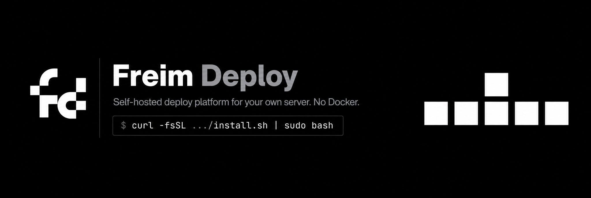
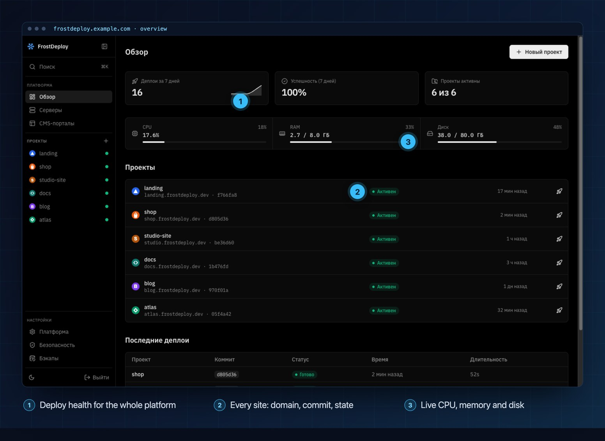
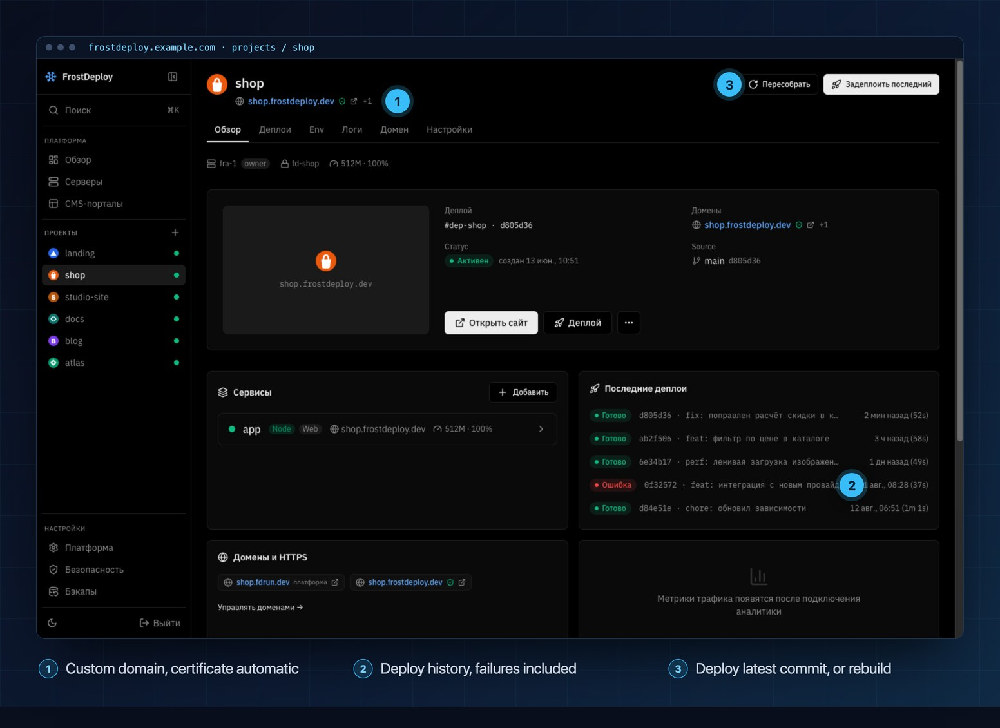
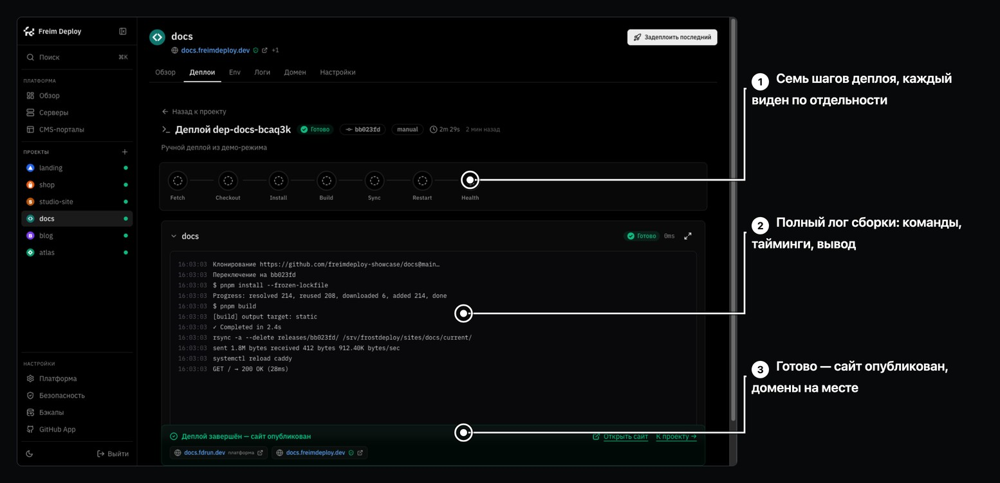
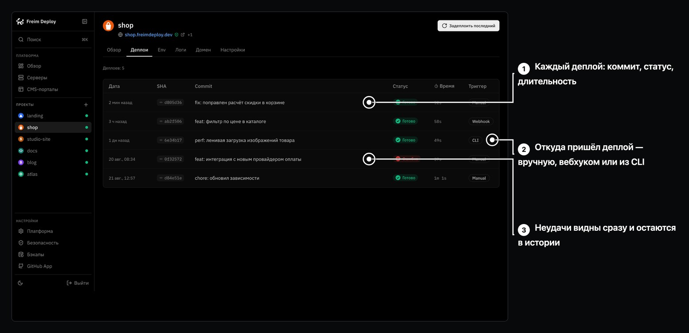
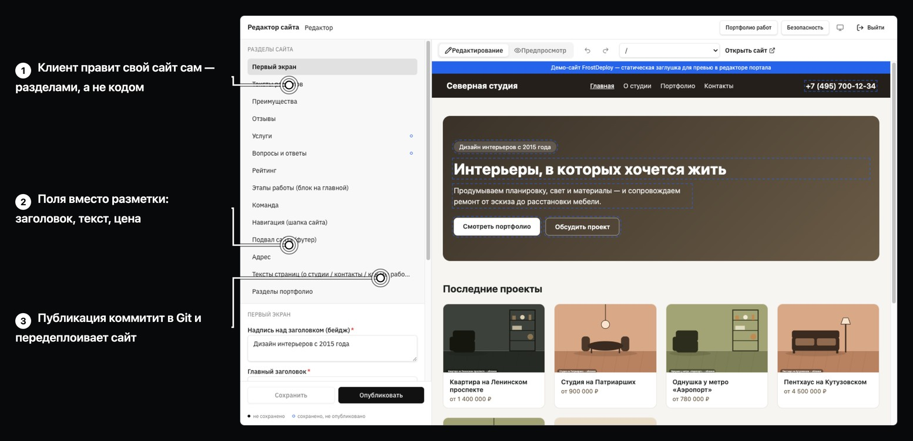
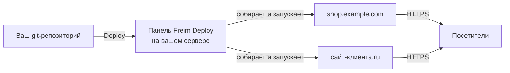
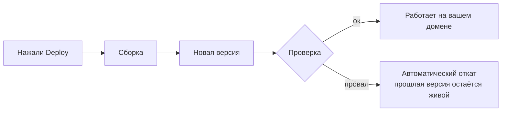

<div align="center">



<p>
  <a href="README.md"></a>
  <a href="README.ru.md"></a>
  <a href="README.zh-CN.md"></a>
  <a href="README.es.md"></a>
</p>

<h3>Свой Vercel — на своём сервере.</h3>

<p><b>Freim Deploy — self-hosted платформа для деплоя сайтов на ваш VPS/VDS,<br>
аналог Vercel, Netlify и Render, который принадлежит вам целиком.</b><br>
Подключаете git-репозиторий, жмёте Deploy — сборка, HTTPS, домены и откат уже сделаны за вас.</p>

<p>
  <a href="https://github.com/ARTFROST1/FreimDeploy/releases/latest"></a>
  <a href="https://github.com/ARTFROST1/FreimDeploy/releases"></a>
  
  <a href="LICENSE"></a>
  <a href="https://github.com/ARTFROST1/FreimSite"></a>
</p>

<p>
  
  
  
  
  
</p>

</div>

> [!NOTE]
> **FrostDeploy теперь называется Freim Deploy.** Тот же продукт, тот же репозиторий, тот же
> установщик — сменилось только имя (в этой же нише есть проект Frost). **На сервере не
> переименовано ничего:** пути (`/opt/frostdeploy`, `/srv/frostdeploy`), команда `frostdeploy` и
> файл `frostdeploy.json`, который вы кладёте в свой репозиторий, сознательно остались со старыми
> именами — чтобы все уже работающие установки продолжали работать и обновляться.

---

## ⚡ Установка

Одна команда на чистом сервере с Debian 12+ / Ubuntu 22.04+, под `root`:

```bash
curl -fsSL https://raw.githubusercontent.com/ARTFROST1/FreimDeploy/main/install.sh | sudo bash
```

<p align="center">
  
</p>

Дальше — **[Быстрый старт](#-быстрый-старт)**: пять шагов, около десяти минут от пустого сервера до
первого сайта на HTTPS.

---

## 🤖 Или пусть это сделает ваш ИИ-агент

Никогда не работали с сервером? Отдайте всю установку Claude Code, Cursor, Codex или любому другому
агенту — этот репозиторий написан так, чтобы агент разобрался сам.

**Скиньте агенту ссылку:**

```
https://github.com/ARTFROST1/FreimDeploy
```

**…или вставьте этот промпт:**

```text
Установи мне Freim Deploy на сервер и настрой всё до конца.

Инструкции — здесь: https://github.com/ARTFROST1/FreimDeploy (README и AGENTS.md).
Читай их и действуй по шагам.

Мой сервер:  root@<IP-СЕРВЕРА>
Мой домен:   <example.com>

Спрашивай у меня всё, что понадобится (доступ к DNS, GitHub-токен, пароли),
говори точно, что мне нажимать, и закончи, когда панель откроется у меня
в браузере на моём домене.
```

Агент проверит DNS, запустит установщик, поднимет SSH-туннель, проведёт вас по мастеру настройки и
отдаст готовую панель. Машиночитаемая инструкция для него — в **[AGENTS.md](AGENTS.md)**.

---

## 🧊 Что вы получаете

Платформу деплоя, которая ведёт себя как Vercel или Netlify, — только сервер, домены, данные и счёт
за всё это ваши.

- **Сколько угодно проектов и сайтов** на одной машине: без тарифов за место, без лимитов на минуты
  сборки.
- **Свои домены**, HTTPS-сертификаты выпускаются и продлеваются автоматически.
- **Деплой в один клик** из ваших GitHub-репозиториев, включая приватные.
- **Мгновенный откат** на любую предыдущую версию — примерно секунда.
- **Работает где угодно**: любой VPS, VDS, выделенный или домашний сервер с Debian или Ubuntu.
  Хватает 1 ГБ памяти.
- **Без Docker, без Kubernetes, без чужого аккаунта.** Ничего никуда не «звонит домой».

Хорошо заходит фрилансерам и студиям, которые держат клиентские сайты, пет-проектам, переросшим
бесплатный тариф, и всем, кому нужен self-hosted PaaS вместо ежемесячного счёта за SaaS.

---

## 📦 Начните с шаблона

**[FreimSite](https://github.com/ARTFROST1/FreimSite)** — официальный шаблон сайта для Freim
Deploy: стартер на Astro 7 с SEO, островной архитектурой и нулём JavaScript по умолчанию.
Каждый редактируемый блок несёт CMS-разметку, которую правит клиентский портал: клиент
кликает по заголовку или цене прямо на живом сайте, вводит новый текст, нажимает
«опубликовать» — и изменение коммитится в Git и передеплоивается. Кнопка **Use this
template** на странице шаблона создаёт новый репозиторий с вашим сайтом; этот репозиторий вы
и подключаете к своей панели Freim Deploy.

---

## 🚀 Быстрый старт

### Шаг 1 — Возьмите сервер

Любой VPS или VDS с **Debian 12+ или Ubuntu 22.04+** (`x86_64`), от 1 vCPU / 1 ГБ RAM / 10 ГБ диска.
При заказе заполните **оба** поля:

- **SSH-ключ** — вставьте содержимое своего `~/.ssh/id_ed25519.pub`. Это повседневный вход.
- **Пароль root** — сохраните в менеджер паролей. Это аварийный вход через VNC-консоль хостера.

### Шаг 2 — Направьте на него домен

Нужен один домен на всё. В панели вашего DNS-провайдера создайте **две A-записи** на IP сервера:

```dns
A   @   →   <IP сервера>     ; сам домен
A   *   →   <IP сервера>     ; wildcard — обязателен
```

Wildcard — это то, благодаря чему каждый следующий проект сразу получает адрес вида
`myshop.example.com`, и в DNS больше лезть не нужно. Проверьте до установки — любое выдуманное имя
должно резолвиться:

```bash
dig +short A что-угодно.example.com @1.1.1.1   # должен вернуть IP вашего сервера
```

### Шаг 3 — Запустите установщик

```bash
ssh root@<IP сервера>
curl -fsSL https://raw.githubusercontent.com/ARTFROST1/FreimDeploy/main/install.sh | sudo bash
```

Две–пять минут. Установщик поставит всё необходимое и запустит панель.

### Шаг 4 — Откройте панель через SSH-туннель

Пока у панели нет вашего домена и сертификата, она не смотрит в интернет — поэтому первый вход идёт
через SSH-туннель.

> [!IMPORTANT]
> Эту команду выполняйте **на своём компьютере**, а не на сервере. Если в приглашении
> `root@сервер:~#` — сначала откройте новое окно терминала.

```bash
ssh -L 9000:127.0.0.1:9000 root@<IP сервера>
```

Не закрывая это окно, откройте в браузере **http://127.0.0.1:9000**.

### Шаг 5 — Пройдите мастер настройки

| Поле | Что вводить |
| --- | --- |
| Пароль администратора | Не короче 14 символов. Сохраните в менеджер паролей |
| GitHub-токен | Fine-grained personal access token с правом `Contents: Read` на нужные репозитории — [создать](https://github.com/settings/personal-access-tokens) |
| Ваш домен | Только домен, например `example.com` — без `https://` и без поддомена |

Готово. Панель переезжает на **`https://frostdeploy.example.com`** со своим сертификатом, туннель
можно закрывать. Дальше всё происходит в интерфейсе: добавить проект, выбрать репозиторий, нажать
Deploy.

> [!WARNING]
> Сохраните в менеджер паролей две вещи: пароль администратора и строку `ENCRYPTION_KEY` из
> `/opt/frostdeploy/.env`. Этот ключ защищает всё, что хранится в панели, — потеряете сервер вместе
> с ключом, и бэкап не спасёт.

---

## 👀 Как это выглядит

**Страница проекта** — один экран на сайт: домен и сертификат, сервисы и вся история деплоев,
включая неудачные.



**Идущий деплой** — семь этапов в реальном времени, каждый сервис репозитория собирается отдельно, а
релиз выезжает только после успешного healthcheck.



**Каждый деплой сохраняется** — коммит, статус, длительность и то, откуда он пришёл: нажатие
вручную, вебхук на push или CLI. Неудачный остаётся в списке, а на любой удачный можно откатиться
в одно нажатие.



**CMS-портал клиента** — клиент открывает свой сайт, кликает по заголовку, правит его и жмёт
«Опубликовать». Изменение уходит коммитом в Git и пересобирается.



---

## ✨ Возможности

|  | Функция | Что это даёт |
| :-: | --- | --- |
| 🔍 | **Автоопределение фреймворка** | Next.js, Astro, Nuxt, SvelteKit, Remix, Python, обычная статика — распознаются сами, конфиг писать не нужно |
| 🚀 | **Деплой в один клик** | Выбрали репозиторий и ветку, нажали Deploy. Сборки кэшируются, повторные деплои быстрые |
| 📡 | **Живые логи сборки** | Видно каждый шаг прямо в дашборде, сборку можно прервать на ходу |
| 🔄 | **Мгновенный откат** | Один клик — и вернулись на любую предыдущую версию |
| 🌐 | **Домены и бесплатный HTTPS** | Свои домены и автоматические поддомены, сертификаты выпускаются и продлеваются за вас |
| 🔐 | **Шифрование секретов** | Переменные окружения и токены хранятся зашифрованными, изменение запускает пересборку |
| 👥 | **Изоляция сайтов** | Каждый сайт работает под собственным системным пользователем — один проект не прочитает другой |
| 🖥 | **Несколько серверов** | Одна панель, много серверов: клиентов можно держать на разных машинах |
| 📊 | **Мониторинг** | CPU, RAM и диск в реальном времени, плюс статус каждого сайта |
| 🔒 | **Серьёзный контроль доступа** | Двухфакторная аутентификация, опциональные клиентские сертификаты, подписанные и проверяемые обновления |
| 💾 | **Бэкапы** | По расписанию — локально или в любое S3-совместимое хранилище |
| 📝 | **CMS-портал для клиентов** | Опциональный кабинет, где клиенты правят контент своих сайтов, не трогая код |

Деплой по push уже работает: как только подключён вебхук, `git push` в GitHub, GitLab, Gitea
или Bitbucket сам собирает и выкатывает сайт — это тот самый триггер «push webhook», который
вы видели выше.

---

## 🛠 Как это работает



Каждый деплой идёт по одному и тому же безопасному пути — и если новая версия не поднялась, старая
продолжает обслуживать посетителей:



---

## ⌨️ Командная строка

Всё делается в панели. Эти команды — на редкий случай, когда нужен сам сервер:

| Команда | Что делает |
| --- | --- |
| `frostdeploy status` | Работает ли панель |
| `frostdeploy logs` | Живые логи панели |
| `frostdeploy restart` | Перезапустить панель |
| `frostdeploy update` | Обновиться до последней версии — при проблеме откатится сама |
| `frostdeploy rollback` | Вернуться на предыдущую версию |
| `frostdeploy reset-password` | Задать новый пароль администратора, если потеряли доступ |
| `frostdeploy uninstall` | Удалить Freim Deploy (с `--purge` — вместе с данными и сайтами) |

---

## 🧯 Если что-то пошло не так

<details>
<summary><b>Браузер не открывает <code>http://127.0.0.1:9000</code></b></summary>

Почти всегда команда `ssh -L …` была выполнена на сервере, а не на своём компьютере. Отличить
просто: `имя@ваш-компьютер ~ %` — вы у себя, `root@сервер:~#` — вы на сервере. Затем на сервере
проверьте `frostdeploy status`.

</details>

<details>
<summary><b>Установщик пишет <code>Unsupported OS</code></b></summary>

Нужен Debian 12+ или Ubuntu 22.04+ на `x86_64`. AlmaLinux, CentOS, Rocky, Fedora, Arch и arm64 не
поддерживаются. Переустановите сервер с подходящим образом.

</details>

<details>
<summary><b>Домен не открывается или без сертификата</b></summary>

Проверьте обе DNS-записи, включая wildcard: `dig +short A что-угодно.example.com @1.1.1.1` должен
вернуть IP сервера. Сертификат выпускается только когда домен уже указывает на сервер, а порты 80 и
443 доступны. Изменения DNS расходятся до нескольких часов.

</details>

<details>
<summary><b>Деплой падает</b></summary>

Откройте лог сборки в дашборде — там видно, на каком шаге. Обычные причины: не задана переменная
окружения, сборке не хватило памяти, или GitHub-токен не имеет доступа к приватному репозиторию. Всё
это время продолжает работать предыдущая версия сайта.

</details>

<details>
<summary><b>После обновления что-то сломалось</b></summary>

`frostdeploy rollback` вернёт предыдущую версию.

</details>

---

## ❓ Частые вопросы

<details>
<summary><b>Чем это отличается от Vercel, Netlify или Render?</b></summary>

Сценарий тот же, экономика и контроль — другие. Сайты работают на железе, которое вы арендуете или
владеете: нет лимитов на минуты сборки, нет сюрпризов по трафику, нет оплаты за каждое место в
команде и нет третьей стороны, у которой лежит ваш прод. Вы платите за сервер, и всё.

</details>

<details>
<summary><b>Нужно ли знать Linux?</b></summary>

Для установки нужно скопировать и вставить две команды. Всё остальное — в веб-панели. Если и это
кажется лишним, отдайте [промпт для агента](#-или-пусть-это-сделает-ваш-ии-агент) любому ИИ-ассистенту,
и он проведёт настройку вместе с вами.

</details>

<details>
<summary><b>Сколько сайтов поместится на один сервер?</b></summary>

Статика почти ничего не стоит — десятки помещаются спокойно. Серверный рендер (Next.js, Nuxt) ест
реальную память: закладывайте примерно 150–300 МБ на проект, так что на 2 ГБ живёт несколько таких
сайтов плюс сама панель.

</details>

<details>
<summary><b>Работает с приватными репозиториями?</b></summary>

Да. Для этого и нужен GitHub-токен в мастере настройки; он хранится зашифрованным.

</details>

<details>
<summary><b>Нужен ли Docker?</b></summary>

Нет. Нечего собирать, пушить и тянуть — сайты работают прямо на сервере, поэтому для старта хватает
1 ГБ памяти.

</details>

<details>
<summary><b>Можно потом переехать на другой сервер?</b></summary>

Да — поставить Freim Deploy на новый сервер и восстановить бэкап.

</details>

<details>
<summary><b>Исходный код открыт?</b></summary>

Нет. Этот репозиторий распространяет установщик и готовые сборки, исходный код закрыт. Обновления
подписаны и проверяются автоматически перед установкой.

</details>

---

## 📚 Документация

Всё, что нужно, чтобы пользоваться Freim Deploy без доступа к исходному коду, лежит в
**[docs/](docs/)** (на английском):

| Документ | О чём |
| --- | --- |
| [Первый сайт](docs/first-deploy.md) | От свежей установки до первого сайта на HTTPS |
| [**frostdeploy.json**](docs/frostdeploy-json.md) | Справочник по конфигу: сборка, команда запуска, статика, монорепо, python-воркеры, несколько сервисов в одном репозитории |
| [Переменные окружения](docs/environment-variables.md) | Сборка против рантайма и почему секреты не попадают в сборку |
| [Домены и HTTPS](docs/domains.md) | Платформенные адреса, свои домены, сертификаты, `www`, редиректы |
| [Добавление серверов](docs/servers.md) | Одна панель — много серверов, что делает bootstrap |
| [Эксплуатация](docs/operations.md) | Обновления, откаты, «сайт лежит», бэкапы, секреты |
| [CMS-портал](docs/cms-portal.md) | Опциональный кабинет, где клиенты правят свой контент |

Тот же список в виде страницы, с объяснением, как связаны Freim Deploy и FreimSite:
[artfrost1.github.io/FreimDeploy](https://artfrost1.github.io/FreimDeploy/).

---

## 🧱 Что внутри

Для любопытных: Node.js 22, SQLite, [Caddy](https://caddyserver.com) для автоматического HTTPS и
systemd для процессов. Никаких контейнеров, оркестраторов и фоновых демонов, которые куда-то
отчитываются, — именно поэтому оно спокойно живёт на самом дешёвом VPS.

---

## 📄 Лицензия

Проприетарная — см. [LICENSE](LICENSE). Установщик открыт, чтобы его можно было прочитать до
запуска; исходный код приложения не распространяется.

<div align="center">
<br>

**[⚡ Установить](#-установка)** · [Релизы](https://github.com/ARTFROST1/FreimDeploy/releases) · [Инструкция для агента](AGENTS.md) · [Задать вопрос](https://github.com/ARTFROST1/FreimDeploy/issues/new/choose)

[English](README.md) · [Русский](README.ru.md) · [简体中文](README.zh-CN.md) · [Español](README.es.md)

<sub><b>Freim Deploy</b> (ранее <b>FrostDeploy</b>) — self-hosted платформа деплоя и аналог Vercel,
Netlify, Render и Heroku для своего VPS. Деплой Next.js, Astro, Nuxt, SvelteKit, Remix и статических сайтов на собственный сервер:
автоматический HTTPS, свои домены, откат в один клик. Self-hosted PaaS в духе Coolify, Dokku и
CapRover — но без Docker.</sub>

<sub>© 2026 ARTFROST1</sub>

</div>
