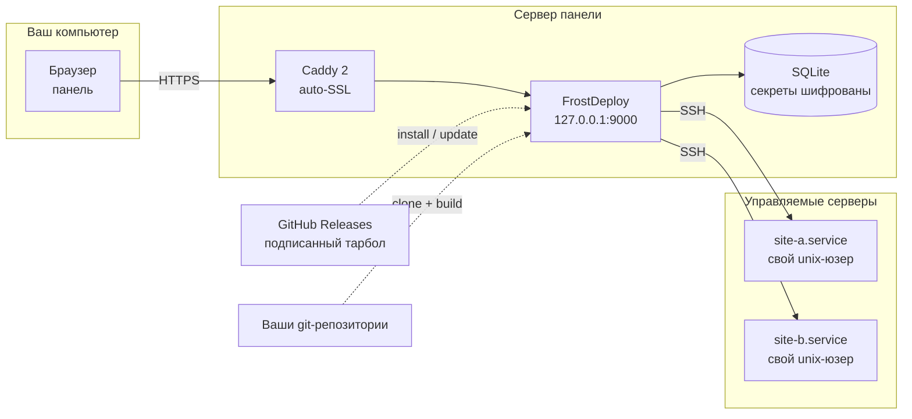
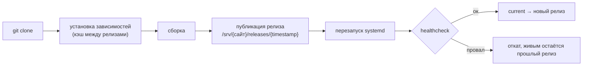

<div align="center">


<h3>Деплой сайтов на собственный сервер — так же, как на Vercel, только панель и VDS ваши.</h3>

<p>
  <a href="https://github.com/ARTFROST1/FrostDeploy/releases/latest"></a>
  <a href="https://github.com/ARTFROST1/FrostDeploy/releases"></a>
  <a href="https://github.com/ARTFROST1/FrostDeploy/releases"></a>
  <a href="LICENSE"></a>
</p>

<p>
  
  
  
  
  
  
  
</p>

<p>
  <a href="#-быстрый-старт"><b>Быстрый старт</b></a> ·
  <a href="#-как-это-устроено"><b>Как это устроено</b></a> ·
  <a href="#-возможности"><b>Возможности</b></a> ·
  <a href="#-cli">CLI</a> ·
  <a href="#-подлинность-релизов">Подлинность релизов</a> ·
  <a href="#-если-что-то-пошло-не-так">Проблемы</a> ·
  <a href="#-частые-вопросы">FAQ</a> ·
  <a href="README.md">🇬🇧 English</a>
</p>

</div>

---

## 🧊 Что это

**FrostDeploy** — self-hosted деплой-платформа, маленький Vercel на вашем собственном VDS.
Подключаете git-репозиторий, жмёте *Deploy* — платформа клонирует его, ставит зависимости,
собирает, публикует атомарный релиз, пишет systemd-юнит, заводит домен в Caddy и получает
TLS-сертификат. Откат — один клик и одна пересборка симлинка.

Без Docker, без Kubernetes, без чужого облака в середине: **Node.js 22 + SQLite + Caddy +
systemd** на обычной Debian или Ubuntu.

> [!NOTE]
> **Этот репозиторий — канал доставки, а не исходники.**
> Здесь лежат установщик (`install.sh`) и подписанные релизы в
> [Releases](https://github.com/ARTFROST1/FrostDeploy/releases). Исходный код закрыт: на серверы
> всегда ставится собранный подписанный тарбол, а не `git clone` движка.

| В репозитории | Что это |
| --- | --- |
| [`install.sh`](install.sh) | Установщик. Автоматически синхронизируется из исходного репозитория при каждом релизе |
| [Releases](https://github.com/ARTFROST1/FrostDeploy/releases) | `frostdeploy-<версия>-linux-x64.tar.gz` + `.sig` (ed25519) + `.sha256` |
| [`CHANGELOG.md`](CHANGELOG.md) | История релизов и схема версионирования |
| — | Исходного кода нет. Так задумано |

---

## 🚀 Быстрый старт

### 1. Что нужно до начала

| Требование | Подробности |
| --- | --- |
| **VDS** | 1 vCPU · 1 ГБ RAM · 10 ГБ диска (минимум для панели и нескольких небольших сайтов) |
| **ОС** | **Debian 12+** или **Ubuntu 22.04+**, `x86_64`. Установщик работает через `apt` — AlmaLinux, CentOS, Rocky, Fedora и Arch не поддерживаются |
| **Доступ** | вход по SSH под `root` |
| **Домен** | и возможность править его DNS-записи |
| **GitHub PAT** | fine-grained токен с правом `Contents: Read` на репозитории ваших проектов. **Мастер настройки спросит его сразу — отложить нельзя** |

> **Совет по заказу VDS.** Заполните оба поля: SSH-ключ (повседневный вход) и root-пароль —
> сохраните его в менеджер паролей. Установщик отключает вход по паролю **по SSH**, но VNC-консоль
> хостера пароль по-прежнему принимает: без него потеря ключа означает потерю сервера.

### 2. DNS: две A-записи

```dns
A   @   →   <IP сервера>     ; апекс
A   *   →   <IP сервера>     ; wildcard — обязателен
```

Wildcard не опция: адрес проекта — `<имя-проекта>.<ваш-домен>` — не хранится, а вычисляется из
имени, иначе каждый новый сайт требовал бы ручной DNS-записи. Проверьте до установки, на любом
выдуманном имени:

```bash
dig +short A что-угодно.ваш-домен @1.1.1.1   # должен вернуть IP сервера
```

### 3. Запустите установщик

```bash
ssh root@ваш-сервер
curl -fsSL https://raw.githubusercontent.com/ARTFROST1/FrostDeploy/main/install.sh | sudo bash
```

Две–пять минут. В выводе должна появиться эта строка — тарбол распаковывается **от root**, поэтому
непроверенный архив обязан остановить установку:

```
 ✅ подпись релиза проверена (ed25519)
```

<details>
<summary><b>Не хочется вслепую отдавать скрипт в shell? (правильный инстинкт)</b></summary>

```bash
curl -fsSL -o install.sh https://raw.githubusercontent.com/ARTFROST1/FrostDeploy/main/install.sh
less install.sh
sudo bash install.sh
```

Скрипт идемпотентен: повторный запуск обновляет систему до последнего релиза и сохраняет
`/opt/frostdeploy/.env` и базу.

</details>

### 4. Первый вход — через SSH-туннель

Панель слушает **только `127.0.0.1:9000`** и в интернет не смотрит. Порт 9000 не открыт в файрволе
и открывать его не нужно никогда: панель — это root-доступ ко всем управляемым серверам, и её
форма входа не должна быть видна из интернета.

> [!IMPORTANT]
> Команду ниже выполняйте **на своём компьютере**, а не на сервере. Если в приглашении
> `root@сервер:~#` — вы всё ещё на сервере, откройте новое окно терминала.

```bash
ssh -L 9000:127.0.0.1:9000 root@ваш-сервер
```

Не закрывая его, откройте **http://127.0.0.1:9000** — это мастер настройки. Заполните:

| Поле | Требования |
| --- | --- |
| Пароль администратора | не короче 14 символов |
| GitHub PAT | из шага 1 |
| Платформенный домен | апекс, например `example.com` — без `https://` и без поддомена |

После мастера панель доступна по HTTPS на `frostdeploy.<ваш-домен>`, сертификат Caddy получит сам.
Туннель больше не нужен в повседневной работе — но команду стоит помнить: он идёт к панели мимо
Caddy и остаётся рабочим входом, даже если сломались как раз HTTPS или проверка клиентских
сертификатов.

> [!WARNING]
> Сохраните в менеджер паролей пароль администратора **и** `ENCRYPTION_KEY` из
> `/opt/frostdeploy/.env`. Этим ключом зашифровано всё чувствительное в базе — GitHub-токен,
> SSH-ключи серверов, переменные окружения проектов. Потеряете сервер вместе с ключом — бэкап базы
> будет бесполезен.

---

## 🛠 Как это устроено



Деплой — фиксированный конвейер, каждый шаг стримится в дашборд в реальном времени:



Релиз — это каталог, `current` — симлинк. Переключение версии в любую сторону — атомарная смена
симлинка плюс рестарт сервиса, поэтому откат занимает около секунды.

<details>
<summary><b>Что установщик реально меняет на хосте</b></summary>

| Путь / объект | Назначение |
| --- | --- |
| `/opt/frostdeploy/releases/<версия>` | Распакованный релиз; `current` указывает на активный |
| `/opt/frostdeploy/.env` | `ENCRYPTION_KEY`, `SESSION_SECRET`, конфиг. Права `600`, владелец root |
| `/var/lib/frostdeploy/` | База SQLite, бэкапы, каталоги сборки. Права `750` |
| `/etc/systemd/system/frostdeploy.service` | Юнит панели |
| `/usr/local/bin/frostdeploy` | CLI управления |
| системный пользователь `frostdeploy` | Служебный аккаунт с `nologin` |
| Node.js 22 (NodeSource), `jq`, Caddy 2 | Ставятся через `apt`, если их нет |
| правило ufw на порт 9000 | **Удаляется**, если осталось от прежней установки |

Сайты живут в `/srv/`, у каждого свой unix-юзер и свой юнит `fd-*.service`.

</details>

---

## ✨ Возможности

|  | Функция | Что это значит |
| :-: | --- | --- |
| 🔍 | **Автоопределение фреймворка** | Next.js, Astro, Nuxt, SvelteKit, Remix, Python, статика — определяются по репозиторию, конфиг не нужен |
| 🚀 | **Деплой в один клик** | `clone → install → build → release → restart → healthcheck`, с кэшем зависимостей между релизами |
| 📡 | **Живые логи** | Каждый шаг конвейера стримится в дашборд через SSE, сборку можно прервать на ходу |
| 🔄 | **Мгновенный откат** | Атомарная смена симлинка на любой предыдущий релиз |
| 🌐 | **Домены и auto-SSL** | Платформенные поддомены и кастомные домены, сертификаты через Caddy + Let's Encrypt, состояние DNS/сертификата/HTTPS видно в UI |
| 🔐 | **Шифрование секретов** | AES-256-GCM для env-переменных, SSH-ключей и токенов; ротация ключа — `frostdeploy reencrypt` |
| 👥 | **Изоляция сайтов** | У каждого сайта свой unix-юзер и свой systemd-юнит; привилегированные действия панель делает через узкий allowlist в sudoers |
| 🖥 | **Много серверов** | Одна панель управляет несколькими серверами по SSH |
| 📊 | **Мониторинг** | CPU, RAM, диск в реальном времени |
| 🔒 | **2FA и mTLS** | TOTP для админского аккаунта, опциональный клиентский сертификат перед панелью |
| 🧱 | **Hardening хоста** | `harden-host.sh` — ufw, fail2ban, sshd drop-in, unattended-upgrades, journald, аудит прав; есть `--dry-run` и финальная проверка PASS/FAIL |
| 💾 | **Бэкапы** | Регулярные бэкапы базы, локально или в S3-совместимое хранилище |
| 📝 | **CMS-портал для клиентов** | Опциональный отдельный сервис, где клиенты правят контент своих сайтов |

---

## ⌨️ CLI

Установщик кладёт `frostdeploy` в `/usr/local/bin`. Запускать на сервере панели.

| Команда | Что делает |
| --- | --- |
| `frostdeploy status` | `systemctl status` панели |
| `frostdeploy logs` | Живой журнал панели (`journalctl -f`) |
| `frostdeploy restart` | Перезапуск панели (и портала, если установлен) |
| `frostdeploy update` | Скачать последний подписанный релиз, переключиться, перезапустить — **автооткат при провале healthcheck** |
| `frostdeploy rollback` | Вернуться на предыдущий релиз |
| `frostdeploy reset-password [пароль]` | Задать новый пароль администратора (спросит, если не указать) |
| `frostdeploy reencrypt [--dry-run]` | Перешифровать секреты текущим `ENCRYPTION_KEY` — для ротации ключа, можно прервать и запустить снова |
| `frostdeploy reclaim-releases [--dry-run]` | Разовая уборка каталогов релизов, оставшихся во владении сборщика после неудачных деплоев |
| `frostdeploy uninstall [--purge] [--yes]` | Удалить программу. Данные и секреты остаются, чтобы переустановка продолжила с того же места — если только не `--purge`, который стирает базы, `/srv`, пользователей проектов и `.env` |

<details>
<summary><b>Обновление, откат, удаление</b></summary>

```bash
frostdeploy update                 # последний релиз, подпись проверяется до распаковки
frostdeploy rollback               # назад на предыдущий релиз

frostdeploy uninstall              # удалить программу, данные и секреты оставить
frostdeploy uninstall --purge      # снести всё, включая сайты и базы
```

`uninstall` перечисляет, что именно удалит, и просит подтверждение — если не передан `--yes`.
Повторный запуск `install.sh` равнозначен `frostdeploy update`.

</details>

---

## 🔏 Подлинность релизов

Каждый релиз подписан **ed25519** в отдельной CI-джобе, где не выполняется сторонний код, а
публичная половина ключа вшита и в `install.sh`, и в CLI `frostdeploy`. Подпись проверяется **до**
распаковки: после `tar` было бы уже поздно — установка продолжается запуском скриптов из этого же
дерева от root. Релиз без валидного `.sig` не ставится вообще, а не «ставится с предупреждением».

В каждом релизе три ассета:

```
frostdeploy-<версия>-linux-x64.tar.gz          сборка
frostdeploy-<версия>-linux-x64.tar.gz.sig      подпись ed25519 (raw, 64 байта)
frostdeploy-<версия>-linux-x64.tar.gz.sha256   контрольная сумма, для удобства
```

<details>
<summary><b>Проверить тарбол вручную</b></summary>

```bash
# публичный ключ — не секрет: он нужен, чтобы отличить наш артефакт от чужого
cat > fd-pub.pem <<'EOF'
-----BEGIN PUBLIC KEY-----
MCowBQYDK2VwAyEAH7ZmEJxyrsoTPoWG+4wLKkf6nwGiwoZWomiJcdY6jOo=
-----END PUBLIC KEY-----
EOF

gh release download --repo ARTFROST1/FrostDeploy --pattern 'frostdeploy-*linux-x64.tar.gz*'

openssl pkeyutl -verify -rawin -pubin -inkey fd-pub.pem \
  -sigfile frostdeploy-*-linux-x64.tar.gz.sig \
  -in      frostdeploy-*-linux-x64.tar.gz
# → Signature Verified Successfully

sha256sum -c <(printf '%s  %s\n' "$(cat frostdeploy-*.sha256)" frostdeploy-*-linux-x64.tar.gz)
```

</details>

Нашли проблему с безопасностью — сообщите приватно: откройте
[security advisory](https://github.com/ARTFROST1/FrostDeploy/security/advisories/new), а не
публичный issue.

---

## ⚙️ Переменные окружения

Для обычной установки настраивать нечего. Эти переменные — для редких случаев:

| Переменная | Когда нужна |
| --- | --- |
| `FD_DIST_TOKEN` | Только если вы ставите из **приватного** зеркала dist-репозитория (например, внутреннего канала студии). Read-only fine-grained PAT; установщик сохранит его в `.env`, чтобы работал `frostdeploy update` |

```bash
# приватное зеркало дистрибутива
export FD_DIST_TOKEN=github_pat_xxx
curl -fsSL -H "Authorization: Bearer $FD_DIST_TOKEN" \
  https://raw.githubusercontent.com/ORG/REPO/main/install.sh | sudo -E bash
```

С этим публичным репозиторием токен не используется, заголовок `Authorization` не отправляется
вовсе.

---

## 🧯 Если что-то пошло не так

<details>
<summary><b><code>E: Unable to locate package jq</code> на свежем сервере</b></summary>

Установщик сам делает `apt-get update` перед первой установкой. Если всё равно падает — apt не
дотягивается до зеркал: проверьте `/etc/apt/sources.list`, DNS и исходящую сеть на сервере.

</details>

<details>
<summary><b><code>Unsupported OS</code></b></summary>

Установщик работает через `apt` и поддерживает только Debian 12+ и Ubuntu 22.04+ на `x86_64`.
RPM-пути нет, сборки под arm64 нет. Переустановите VDS с поддерживаемым образом — обходной путь
всё равно упадёт дальше, на systemd или Caddy.

</details>

<details>
<summary><b><code>ПОДПИСЬ РЕЛИЗА НЕ СХОДИТСЯ</code></b></summary>

Установка останавливается намеренно. Либо архив скачался битым (повторите), либо это не наш
артефакт. Обходить проверку нельзя: проверьте тарбол вручную командами выше, и если расхождение
настоящее — заводите security advisory.

</details>

<details>
<summary><b>Браузер не открывает <code>http://127.0.0.1:9000</code></b></summary>

Чаще всего `ssh -L` был выполнен на сервере, а не на своём компьютере. Отличить просто:
`имя@ваш-компьютер ~ %` — вы у себя, `root@сервер:~#` — вы на сервере. Дальше проверьте
`frostdeploy status`. Открывать порт 9000 в файрволе как «временное решение» — нельзя.

</details>

<details>
<summary><b>Панель работает, но домен не резолвится или без сертификата</b></summary>

Проверьте обе A-записи, включая wildcard: `dig +short A что-угодно.ваш-домен @1.1.1.1`.
Let's Encrypt выдаст сертификат только если открыты порты 80 и 443 и домен указывает на этот
сервер; настоящую ошибку ACME видно в `journalctl -u caddy -f`.

</details>

<details>
<summary><b>Сервис не поднимается после обновления</b></summary>

`frostdeploy update` откатывается сам, если healthcheck не прошёл. Если вы пришли сюда другим
путём: `frostdeploy rollback`, затем `journalctl -u frostdeploy -n 100 --no-pager` — там причина.

</details>

---

## ❓ Частые вопросы

<details>
<summary><b>Исходный код открыт?</b></summary>

Нет. Движок разрабатывается в приватном репозитории, этот — распространяет установщик и собранные
релизы. Именно поэтому релизы подписаны: артефакт — единственное, что вы можете проверить, значит
он должен быть проверяемым.

</details>

<details>
<summary><b>Можно поставить на сервер, где уже крутятся сайты?</b></summary>

Технически да, но осознанно: FrostDeploy управляет конфигурацией Caddy, создаёт systemd-юниты и
unix-пользователей. Если Caddy на машине уже что-то обслуживает, установщик замечает чужую
конфигурацию и не забирает её молча. Спокойный путь — отдельный VDS.

</details>

<details>
<summary><b>Почему без Docker?</b></summary>

Цель — небольшие VDS с 1 ГБ памяти, где сборка образа и реестр стоят дороже самого сайта.
systemd-юниты, отдельные unix-юзеры и релизы-каталоги дают изоляцию и атомарное переключение без
контейнерного рантайма в цепочке.

</details>

<details>
<summary><b>Работает с приватными репозиториями?</b></summary>

Да, для этого и нужен GitHub PAT в мастере настройки. Он хранится зашифрованным под
`ENCRYPTION_KEY` и используется для клонирования.

</details>

<details>
<summary><b>Какие стеки умеет деплоить?</b></summary>

Статика и Node-фреймворки (Next.js, Astro, Nuxt, SvelteKit, Remix) определяются автоматически, плюс
Python-сервисы. Всё, у чего есть команда сборки и команда запуска, настраивается вручную.

</details>

<details>
<summary><b>arm64 / Raspberry Pi?</b></summary>

Сегодня — нет: публикуются только сборки `linux-x64`.

</details>

---

## 🧱 Стек

| Слой | Технология |
| --- | --- |
| API | Node.js 22 + [Hono](https://hono.dev) 4 |
| База | SQLite (WAL) + [Drizzle ORM](https://orm.drizzle.team) |
| Панель | React 19 + Vite + Tailwind CSS 4 + [shadcn/ui](https://ui.shadcn.com) |
| Прокси | [Caddy](https://caddyserver.com) 2 — Admin API, автоматический HTTPS |
| Процессы | systemd — по сгенерированному юниту на сайт |
| Доставка | GitHub Releases, тарболы с подписью ed25519 |

---

## 📄 Лицензия

Проприетарная — см. [LICENSE](LICENSE). Установщик опубликован здесь, чтобы его можно было прочитать
до запуска; это не открытая лицензия на сам FrostDeploy. Релизы лицензируются их получателям,
исходный код не распространяется.

<div align="center">
<br>

**[⬆ Наверх](#)** · [Релизы](https://github.com/ARTFROST1/FrostDeploy/releases) · [Changelog](CHANGELOG.md) · [Сообщить о проблеме](https://github.com/ARTFROST1/FrostDeploy/issues/new/choose) · [🇬🇧 English version](README.md)

<sub>© 2026 ARTFROST1 · Для тех, кто предпочитает владеть сервером.</sub>

</div>
