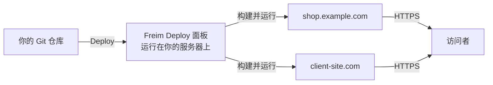
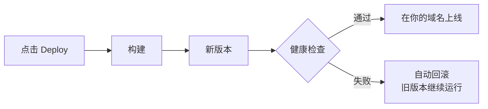

<div align="center">


<p>
  <a href="README.md"></a>
  <a href="README.ru.md"></a>
  <a href="README.zh-CN.md"></a>
  <a href="README.es.md"></a>
</p>

<h3>属于你自己的 Vercel，跑在你自己的服务器上。</h3>

<p><b>Freim Deploy 是部署在自有 VPS / VDS 上的自托管部署平台，<br>
是完全属于你的 Vercel、Netlify、Render 替代方案。</b><br>
连接 Git 仓库，点一下 Deploy：构建、HTTPS、域名和回滚全部自动完成。</p>

<p>
  <a href="https://github.com/ARTFROST1/FreimDeploy/releases/latest"></a>
  <a href="https://github.com/ARTFROST1/FreimDeploy/releases"></a>
  
  <a href="LICENSE"></a>
  <a href="https://github.com/ARTFROST1/FreimSite"></a>
</p>

<p>
  
  
  
  
  
</p>

</div>

> [!NOTE]
> **FrostDeploy 现已更名为 Freim Deploy。** 还是同一个产品、同一个仓库、同一个安装脚本，只是换了名字（这个
> 领域里已经有一个叫 Frost 的项目）。**服务器上的名字一个都没有改：** 路径（`/opt/frostdeploy`、
> `/srv/frostdeploy`）、命令 `frostdeploy`，以及你放进自己仓库的 `frostdeploy.json`，都是特意保留旧名
> 字的，好让已经装好的实例继续正常运行、继续自动更新。

---

## 安装

在全新的 Debian 12+ / Ubuntu 22.04+ 服务器上，以 `root` 执行一条命令：

```bash
curl -fsSL https://raw.githubusercontent.com/ARTFROST1/FreimDeploy/main/install.sh | sudo bash
```

<p align="center">
  
</p>

然后按 **[快速开始](#快速开始)** 走完五步 —— 大约十分钟，从一台空服务器到第一个站点上线并启用 HTTPS。

---

## 或者交给 AI 代理

从没碰过服务器？把整件事交给 Claude Code、Cursor、Codex 或任何编程代理 —— 这个仓库就是按照"让代理能读懂"来写的。

**把这个链接发给你的代理：**

```
https://github.com/ARTFROST1/FreimDeploy
```

**……或者直接粘贴这段提示词：**

```text
请帮我在服务器上安装并完整配置 Freim Deploy。

说明在这里：https://github.com/ARTFROST1/FreimDeploy（README 和 AGENTS.md）。
按照上面的步骤逐步执行。

我的服务器：root@<服务器 IP>
我的域名：  <example.com>

需要什么就问我（DNS 权限、GitHub 令牌、密码），明确告诉我该点哪里，
直到面板在我浏览器里用我自己的域名打开为止。
```

代理会检查 DNS、运行安装脚本、建立 SSH 隧道、带你走完设置向导，最后把一个可用的面板交到你手里。给代理看的机器可读说明在 **[AGENTS.md](AGENTS.md)**。

---

## 你会得到什么

一个用起来像 Vercel、Netlify 的部署平台 —— 只不过服务器、域名、数据和账单都归你。

- **项目和站点数量不限**，全都跑在一台机器上：不按人头收费，没有构建分钟数限制。
- **使用你自己的域名**，HTTPS 证书自动签发、自动续期。
- **一键部署** GitHub 仓库，私有仓库同样支持。
- **秒级回滚** 到任意历史版本。
- **哪儿都能跑** —— 任何 VPS、VDS、独立服务器，甚至家里的小主机，只要是 Debian 或 Ubuntu。1 GB 内存即可起步。
- **不需要 Docker，不需要 Kubernetes，不需要第三方账号。** 不会向任何地方回传数据。

适合托管客户站点的自由职业者和工作室，适合已经超出免费额度的个人项目，也适合任何想要自托管 PaaS 而不是每月付 SaaS 账单的人。

---

## 从模板开始

**[FreimSite](https://github.com/ARTFROST1/FreimSite)** 是 Freim Deploy 的官方站点模板 ——
一个基于 Astro 7 的启动模板，自带 SEO、islands 架构，默认零 JavaScript。页面上每个可编辑的
区块都带有 CMS 标记，客户门户正是靠它工作：客户直接在上线的网站上点击标题或价格，输入新
内容，点击发布，改动就会提交到 Git 并重新部署。仓库页面上的 **Use this template** 按钮可以
从这个模板一键新建站点，然后把它接到你的 Freim Deploy 面板。

---

## 快速开始

### 第 1 步 —— 准备服务器

任意 VPS 或 VDS，系统为 **Debian 12+ 或 Ubuntu 22.04+**（`x86_64`），配置从 1 vCPU / 1 GB 内存 / 10 GB 硬盘起。下单时**两项都要填**：

- **SSH 公钥** —— 粘贴你的 `~/.ssh/id_ed25519.pub`，这是日常登录方式。
- **root 密码** —— 存进密码管理器。这是通过服务商 VNC 控制台的应急入口。

### 第 2 步 —— 把域名指向它

整套系统只需要一个域名。在 DNS 服务商处创建**两条 A 记录**，都指向服务器 IP：

```dns
A   @   →   <服务器 IP>      ; 域名本身
A   *   →   <服务器 IP>      ; 泛解析 —— 必须有
```

有了泛解析，以后每个新项目都会自动获得 `myshop.example.com` 这样的地址，不用再动 DNS。安装前先验证 —— 任意编造的名字都应该能解析：

```bash
dig +short A anything.example.com @1.1.1.1   # 应返回你的服务器 IP
```

### 第 3 步 —— 运行安装脚本

```bash
ssh root@<服务器 IP>
curl -fsSL https://raw.githubusercontent.com/ARTFROST1/FreimDeploy/main/install.sh | sudo bash
```

耗时 2–5 分钟，脚本会装好所有依赖并启动面板。

### 第 4 步 —— 通过 SSH 隧道打开面板

在拿到你的域名和证书之前，面板不对公网开放，所以第一次登录走 SSH 隧道。

> [!IMPORTANT]
> 这条命令要在**你自己的电脑上**执行，不是在服务器上。如果提示符显示 `root@server:~#`，请先新开一个终端窗口。

```bash
ssh -L 9000:127.0.0.1:9000 root@<服务器 IP>
```

保持这个窗口开着，在浏览器打开 **http://127.0.0.1:9000**。

### 第 5 步 —— 完成设置向导

| 字段 | 填什么 |
| --- | --- |
| 管理员密码 | 至少 14 位，存进密码管理器 |
| GitHub 令牌 | fine-grained personal access token，对要部署的仓库有 `Contents: Read` 权限 —— [去创建](https://github.com/settings/personal-access-tokens) |
| 你的域名 | 只填域名，例如 `example.com` —— 不带 `https://`，不带子域名 |

完成。面板会迁移到 **`https://frostdeploy.example.com`** 并拥有自己的证书，隧道可以关掉了。之后一切都在界面里完成：添加项目、选择仓库、点击 Deploy。

> [!WARNING]
> 请把两样东西存进密码管理器：管理员密码，以及 `/opt/frostdeploy/.env` 里的 `ENCRYPTION_KEY`。这把密钥保护着面板中存储的一切 —— 如果服务器和密钥一起丢了，备份也救不回来。

---

## 界面一览

**项目页面** —— 一个站点一个屏幕：域名与证书、服务列表，以及完整的部署历史（包括失败的那次）。


**正在进行的部署** —— 七个阶段实时推送，仓库里的每个服务各自构建，只有健康检查通过后版本才会上线。


**每次部署都会保留** —— 提交、状态、耗时，以及它由什么触发：手动点击、push webhook 还是 CLI。失败的部署会留在列表里，任何一次成功的部署都可以一键回滚。


**客户 CMS 门户** —— 客户打开自己的站点，点击标题直接编辑，然后点「发布」。改动会提交到 Git 并自动重新部署。


---

## 功能

| 功能 | 对你意味着什么 |
| --- | --- |
| **框架自动识别** | Next.js、Astro、Nuxt、SvelteKit、Remix、Python、纯静态 —— 自动识别，无需写配置 |
| **一键部署** | 选好仓库和分支，点击 Deploy。构建有缓存，重复部署很快 |
| **实时构建日志** | 在面板里看到每一步，构建中途可随时取消 |
| **秒级回滚** | 一次点击回到任意历史版本 |
| **域名与免费 HTTPS** | 自定义域名和自动子域名，证书自动签发和续期 |
| **密钥加密存储** | 环境变量和令牌加密保存，修改后自动触发重新构建 |
| **站点相互隔离** | 每个站点以独立系统用户运行 —— 项目之间互相读不到 |
| **多服务器管理** | 一个面板管理多台服务器：不同客户可以放在不同机器上 |
| **监控** | CPU、内存、磁盘实时可见，还有每个站点的状态 |
| **认真的访问控制** | 双因素认证、可选客户端证书、更新包签名校验 |
| **备份** | 定时备份到本地或任意 S3 兼容存储 |
| **客户 CMS 门户** | 可选的配套后台，让你的客户自己改站点内容，不用碰代码 |

每次 push 自动部署已经上线：只要连接了 webhook，向 GitHub、GitLab、Gitea 或 Bitbucket 的 `git push` 就会自动构建并上线 —— 就是你在上面看到的「push webhook」触发方式。

---

## 工作原理



每次部署都走同一条安全路径 —— 如果新版本起不来，旧版本继续对外服务：



---

## 命令行

日常操作都在面板里完成。下面这些命令是给少数需要登录服务器的场景准备的：

| 命令 | 作用 |
| --- | --- |
| `frostdeploy status` | 面板是否在运行 |
| `frostdeploy logs` | 实时查看面板日志 |
| `frostdeploy restart` | 重启面板 |
| `frostdeploy update` | 更新到最新版本 —— 出问题会自动回滚 |
| `frostdeploy rollback` | 回到上一个版本 |
| `frostdeploy reset-password` | 忘记密码时重设管理员密码 |
| `frostdeploy uninstall` | 卸载 Freim Deploy（加 `--purge` 会连数据和站点一起删除） |

---

## 故障排查

<details>
<summary><b>浏览器打不开 <code>http://127.0.0.1:9000</code></b></summary>

几乎总是因为 `ssh -L …` 跑在了服务器上，而不是你自己的电脑。看提示符：`you@your-laptop ~ %` 是你的电脑，`root@server:~#` 是服务器。然后在服务器上执行 `frostdeploy status` 确认面板正在运行。

</details>

<details>
<summary><b>安装脚本提示 <code>Unsupported OS</code></b></summary>

Freim Deploy 需要 `x86_64` 架构的 Debian 12+ 或 Ubuntu 22.04+。AlmaLinux、CentOS、Rocky、Fedora、Arch 和 arm64 均不支持，请用受支持的镜像重装系统。

</details>

<details>
<summary><b>域名打不开，或者没有证书</b></summary>

检查两条 DNS 记录，包括泛解析：`dig +short A anything.example.com @1.1.1.1` 必须返回你的服务器 IP。只有域名已经指向服务器、80 和 443 端口可达时才会签发证书。DNS 生效可能需要几小时。

</details>

<details>
<summary><b>部署失败</b></summary>

打开面板里的构建日志，可以看到具体卡在哪一步。常见原因：缺少环境变量、构建过程内存不够、GitHub 令牌读不到私有仓库。整个过程中，上一次部署的版本一直在正常提供服务。

</details>

<details>
<summary><b>更新后出问题</b></summary>

`frostdeploy rollback` 会回到上一个版本。

</details>

---

## 常见问题

<details>
<summary><b>它和 Vercel、Netlify、Render 有什么不同？</b></summary>

工作流一样，成本结构和控制权不同。站点跑在你租用或自有的硬件上：没有构建分钟数限制，没有流量账单意外，不按人头收费，也没有第三方掌握你的生产环境。你只需要为服务器付费。

</details>

<details>
<summary><b>需要懂 Linux 吗？</b></summary>

安装过程只需要复制粘贴两条命令，之后所有操作都在网页面板里。如果连这一步都嫌麻烦，把 [代理提示词](#或者交给-ai-代理) 交给任意 AI 助手，它会带着你完成配置。

</details>

<details>
<summary><b>一台服务器能放多少站点？</b></summary>

静态站点几乎不占资源，放几十个都很轻松。服务端渲染应用（Next.js、Nuxt）会实际占用内存：每个大约按 150–300 MB 估算，所以 2 GB 的机器可以跑好几个再加上面板本身。

</details>

<details>
<summary><b>支持私有仓库吗？</b></summary>

支持。设置向导里的 GitHub 令牌就是干这个的，它会被加密保存。

</details>

<details>
<summary><b>需要 Docker 吗？</b></summary>

不需要。没有镜像要构建、推送或拉取 —— 站点直接跑在服务器上，所以 1 GB 内存就够起步。

</details>

<details>
<summary><b>以后能换服务器吗？</b></summary>

可以 —— 在新服务器上安装 Freim Deploy，然后恢复备份。

</details>

<details>
<summary><b>源码开放吗？</b></summary>

不开放。本仓库分发的是安装脚本和可直接运行的构建产物，应用源码是私有的。更新包带签名，安装前会自动校验。

</details>

---

## 文档

在没有源代码的情况下运行 Freim Deploy 所需的一切，都在 **[docs/](docs/)**（英文）：

| 文档 | 内容 |
| --- | --- |
| [第一个站点](docs/first-deploy.md) | 从全新安装到第一个站点上线并启用 HTTPS |
| [**frostdeploy.json**](docs/frostdeploy-json.md) | 配置参考：构建、启动命令、静态产物、Monorepo、Python worker、一个仓库多个服务 |
| [环境变量](docs/environment-variables.md) | 构建时与运行时的区别，以及为什么密钥不会进入构建 |
| [域名与 HTTPS](docs/domains.md) | 平台地址、自定义域名、证书、`www`、重定向 |
| [添加服务器](docs/servers.md) | 一个面板管理多台服务器，bootstrap 做了什么 |
| [日常运维](docs/operations.md) | 更新、回滚、站点挂了怎么办、备份、密钥 |
| [客户 CMS 门户](docs/cms-portal.md) | 可选门户，让客户自己编辑内容 |

想要一个可以直接浏览的页面？同样的索引，加上 Freim Deploy 与 FreimSite 如何配合的说明，也发布在
[artfrost1.github.io/FreimDeploy](https://artfrost1.github.io/FreimDeploy/)。

---

## 技术栈

给好奇的人：Node.js 22、SQLite、[Caddy](https://caddyserver.com)（自动 HTTPS）、systemd（进程管理）。没有容器，没有编排系统，没有偷偷回传数据的后台守护进程 —— 所以它能在最便宜的 VPS 上安稳运行。

---

## 许可证

专有软件 —— 见 [LICENSE](LICENSE)。安装脚本公开是为了让你在执行前能先读一遍；应用源码不对外分发。

<div align="center">
<br>

**[立即安装](#安装)** · [版本发布](https://github.com/ARTFROST1/FreimDeploy/releases) · [代理说明](AGENTS.md) · [提问](https://github.com/ARTFROST1/FreimDeploy/issues/new/choose)

[English](README.md) · [Русский](README.ru.md) · [简体中文](README.zh-CN.md) · [Español](README.es.md)

<sub><b>Freim Deploy</b>（原 <b>FrostDeploy</b>）—— 自托管部署平台，Vercel、Netlify、Render、Heroku 的自建替代方案。在自己的 VPS / VDS
上部署 Next.js、Astro、Nuxt、SvelteKit、Remix 和静态网站，自动 HTTPS、自定义域名、一键回滚。类似 Coolify、
Dokku、CapRover 的自托管 PaaS —— 但不需要 Docker。</sub>

<sub>© 2026 ARTFROST1</sub>

</div>
